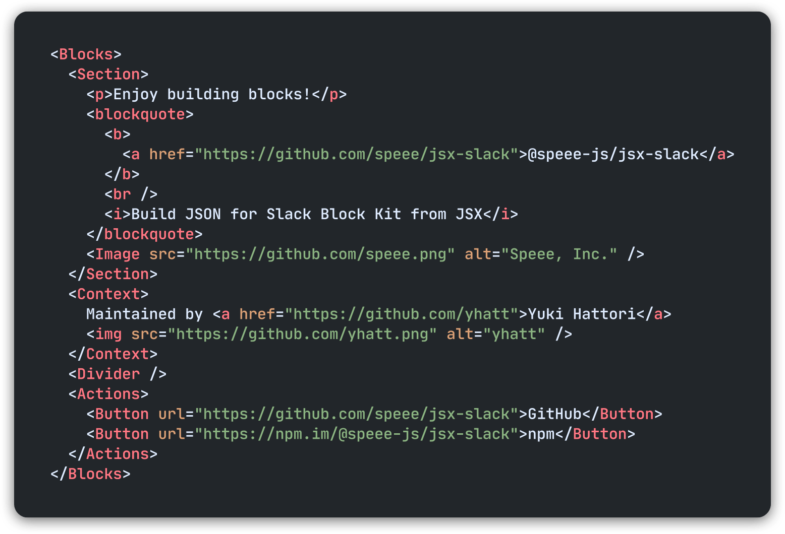
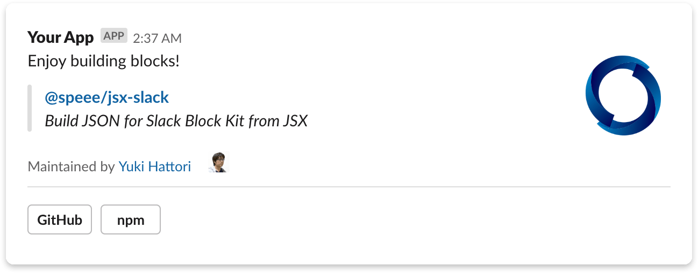

<h1 align="center">
  <a href="https://npm.im/@speee-js/jsx-slack">
    <br />
    
  </a>
</h1>

[][circleci]
[](https://codecov.io/gh/speee/jsx-slack)
[][npm]
[][license]

[circleci]: https://circleci.com/gh/speee/jsx-slack/
[npm]: https://npm.im/@speee-js/jsx-slack
[license]: ./LICENSE

Build JSON object for [Slack][slack] [block kit] surfaces from [JSX].

> :sparkles: **We have sparkling jsx-slack v2!** :sparkles: **[▶︎ See highlight of v2](docs/highlight/v2.md)**

[slack]: https://slack.com
[jsx]: https://reactjs.org/docs/introducing-jsx.html
[react]: https://reactjs.org/
[block kit]: https://api.slack.com/block-kit
[block kit builder]: https://api.slack.com/tools/block-kit-builder

<p align="center">
  <br />
  
</p>

:point_right: **[Try our REPL demo](https://speee-jsx-slack.netlify.app/)** in https://speee-jsx-slack.netlify.app/.

### Features

- **[Block Kit as components](docs/jsx-components-for-block-kit.md)** - Build contents for any surfaces by composing components for Block Kit with JSX.
- **[HTML-like formatting](docs/html-like-formatting.md)** - Keep a readability by using well-known elements.

See **[references](#references)** to dive into jsx-slack deeply.

## Motivation

When developing Slack-integrated app, continuous maintenance of the rich contents is a difficult task. A team member must read and write JSON with deep knowledge about specifications of payload for Slack API.

We believe JSX-based template well-known in front-end development would enhance a developer experience of Slack app.

## Project goal

A project goal is creating an interface to compose contents for Slack with keeping code maintainability by using [JSX].

jsx-slack would allow composing contents with simple and predictable HTML-like markup. It helps in understanding the structure of complex contents and interactions.

## Install

We require Node.js >= 10. If you are using TypeScript, we also require TS >= 3.7.

```bash
# npm
npm install --save @speee-js/jsx-slack
```

```bash
# yarn
yarn add @speee-js/jsx-slack
```

## Usage

### Quick start: Template literal

Do you hate troublesome setting up for JSX? All right. We provide **`jsxslack`** tagged template literal to build blocks _right out of the box_.

It allows the template syntax almost same as JSX, powered by [HTM (Hyperscript Tagged Markup)](https://github.com/developit/htm). Setting for transpiler and importing built-in components are not required.

This is a simple example of the template function just to say hello to someone.

```javascript
import { jsxslack } from '@speee-js/jsx-slack'

export const exampleBlock = ({ name }) => jsxslack`
  <Blocks>
    <Section>
      Hello, <b>${name}</b>!
    </Section>
  </Blocks>
`
```

### [JSX Transpiler](docs/how-to-setup-jsx-transpiler.md)

When you want to use jsx-slack with JSX transpiler, you have to set up to use imported our parser `JSXSlack.createElement` or its alias `JSXSlack.h`.

```jsx
/** @jsx JSXSlack.h */
import { JSXSlack, Blocks, Section } from '@speee-js/jsx-slack'

export const exampleBlock = ({ name }) => (
  <Blocks>
    <Section>
      Hello, <b>{name}</b>!
    </Section>
  </Blocks>
)
```

**[▶︎ How to setup JSX transpiler](docs/how-to-setup-jsx-transpiler.md)** (Babel / TypeScript)

### Use template in Slack API

After than, just use created template in Slack API. We are using the official Node SDK [`@slack/web-api`](https://github.com/slackapi/node-slack-sdk) in this example. [See also Slack guide.](https://slackapi.github.io/node-slack-sdk/web_api)

```javascript
import { WebClient } from '@slack/web-api'
import { exampleBlock } from './example'

const web = new WebClient(process.env.SLACK_TOKEN)

web.chat
  .postMessage({
    channel: 'C1234567890',
    blocks: exampleBlock({ name: 'Yuki Hattori' }),
  })
  .then((res) => console.log('Message sent: ', res.ts))
  .catch(console.error)
```

It would post a simple Slack message like this:

[][block-kit-builder-example]

[][block-kit-builder-example]

[block-kit-builder-example]: https://speee-jsx-slack.netlify.app/#bkb:jsx:eJyzccrJT84utuNSULAJTk0uyczPA7EVFDxSc3LydRRskuwiS7MzFTwSS0ryizJt9JPsFEFq9eGKbfShRgAAVeQWug==

## Block Kit as components

Slack has recommended to use **[Block Kit]** for building tempting messages and modals.

By using jsx-slack, you can build a template with piling up Block Kit blocks by JSX. It is feeling like using components in React or Vue.

### [For messaging](https://speee-jsx-slack.netlify.app/)

```jsx
<Blocks>
  <Section>
    <p>Enjoy building blocks!</p>
    <blockquote>
      <b>
        <a href="https://github.com/speee/jsx-slack">@speee-js/jsx-slack</a>
      </b>
      <br />
      <i>Build JSON for Slack Block Kit from JSX</i>
    </blockquote>
    <Image src="https://github.com/speee.png" alt="Speee, Inc." />
  </Section>
  <Context>
    Maintained by <a href="https://github.com/yhatt">Yuki Hattori</a>
    
  </Context>
  <Divider />
  <Actions>
    <Button url="https://github.com/speee/jsx-slack">GitHub</Button>
    <Button url="https://npm.im/@speee-js/jsx-slack">npm</Button>
  </Actions>
</Blocks>
```

### [For modal](https://speee-jsx-slack.netlify.app/#modal)

```jsx
<Modal title="My first modal" close="Cancel">
  <Section>
    <p>
      <strong>It's my first modal!</strong> :sunglasses:
    </p>
    <p>jsx-slack also has supported Slack Modals.</p>
  </Section>
  <Divider />

  <Input type="text" name="subject" label="Subject" required />
  <Textarea name="message" label="Message" maxLength={500} />

  <ConversationsSelect
    name="shareWith"
    label="Share with..."
    required
    include={['public', 'im']}
    excludeBotUsers
    responseUrlEnabled
  />

  <Input type="hidden" name="postId" value="xxxx" />
  <Input type="submit" value="Send" />
</Modal>
```

### [For home tab](https://speee-jsx-slack.netlify.app/#home)

```jsx
<Home>
  <Image src="https://source.unsplash.com/random/960x240?home" alt="home" />
  <Section>
    <b>Welcome back to my home!</b> :house_with_garden:
  </Section>
  <Divider />
  <Section>What's next?</Section>
  <Actions>
    <RadioButtonGroup actionId="next">
      <RadioButton value="tickets" checked>
        <b>See assigned tickets</b> :ticket:
        <small>
          <i>Check your tickets to start your work.</i>
        </small>
      </RadioButton>
      <RadioButton value="reminder">
        <b>Remind a task later</b> :memo:
        <small>
          <i>I'll remember a task for you.</i>
        </small>
      </RadioButton>
      <RadioButton value="pomodoro">
        <b>Start pomodoro timer</b> :tomato:
        <small>
          <i>Get focused on your time, with tomato!</i>
        </small>
      </RadioButton>
    </RadioButtonGroup>
    <Button actionId="start" style="primary">
      Start working
    </Button>
  </Actions>
</Home>
```

### References

- **[How to setup JSX transpiler](docs/how-to-setup-jsx-transpiler.md)**
- **[JSX components for Block Kit](docs/jsx-components-for-block-kit.md)**
  - [Block containers](docs/block-containers.md)
  - [Layout blocks](docs/layout-blocks.md)
  - [Block elements](docs/block-elements.md)
    - [Interactive components](docs/block-elements.md#interactive-components)
    - [Composition objects](docs/block-elements.md#composition-objects)
    - [Input components for modal](docs/block-elements.md#input-components-for-modal)

* **[HTML-like formatting](docs/html-like-formatting.md)**
* **[About escape and exact mode](docs/about-escape-and-exact-mode.md)**

### Examples by use cases

Ported from templates for [Block Kit Builder].

#### [Message](https://api.slack.com/tools/block-kit-builder?mode=message&template=1)

- [Approval (New device request)](https://speee-jsx-slack.netlify.app/#jsx:eJyNk8tOwzAQRfd8xcgbQCpNH-oGuZFCoauCEAUhVtU0mRArjm1sJ1X4etwHKFAWXXk88j1zR1fmN1KnpYvPAPiSUi-02tYAb7qGAhsCBEUbsPRRk_PXfG0h2r_g6_0ZKoTCUj5lOZa0EKrse31XGalbokercyGpn-qKxXNLGdwpKwLsE67gIZAzakRK3wN4hAd6tMPzqOPqt0M-FySzHw_r-Lk1dL3VdUwCzHRlak8WLiQar83lAd9RH5FeC1LHpGW9roT3YYWk9jAcnABaoPPwYjL0_zi7RxsoPRgNhhO4GENLaF0PJlBp5Qt3itEnQqf_sZpICY3ekISSWgdoSZ172GhbCvXePwG8NJS6Yy6bFUQeCwixwnDCQobzsGIvxIdStpCHC_uL_51hsivdYe5N7b1W0KCsacpSKdJyVdFqOBozcL6VoWmsqNC2LE6MsbohHu1FpxMyVO9kWXxLqu2qefRjJrT3H-ELlV3gbw==)
- [Approval (Time Off request)](https://speee-jsx-slack.netlify.app/#jsx:eJyNUstu2zAQvOcrNjwlQGPGdtGDQRtwmgY5JUESoOjJWNErijBfJSkb6teXktzCbnvoaRfkzOzskOLOeLlLqwsA8UYya-_6HuCbb6HBPQGCowNE-t5SygtRReAjQlRjLR1CE6leMuW9MjSR3rLVQ6QtfHFRF-IPuIF3bQme6_qXlOB41OGDkOAn88-9CG0VpCiXrMk5pAXnGPQkGZS7fhYv17wa9uDVrtpkssFgpo22qCgVcIh-jyY90eGe9lrSJDjFAE1essIPbaYIuWlt5VAbdrLgexdo0Rs82fsF9RZyv42v6_M8vjbk_oSvWwXT25uhzM_hj76NacDD9NPkFq5msMUuXZ-jXsmidtopqNCgk6MhmM8Ko-kV4Orjv3ifvbXk8nEAe0CrTQfaQfYH9wGU7yUl2lDqJfvrBdZDm45yd23O3kFJsaUSmtFyt7G0mc7mDFLuTDkMseQdO7ZaD3mT4CPp_xW26BRFtron152yBf9tphyPH_YnSI_WBA==)
- [Notification](https://speee-jsx-slack.netlify.app/#jsx:eJzNVE1r20AUvPdXPHRpC7HXdj4OQhbBbiEuKQTsUujFPEnP1qL9ELsrue6v71NkFzUJoYcWetIe3s7Mm5lVslA2r3z6BiBZUx6kNd0Z4N7ayoOSFcHRNlBiS4Dg85KKRkmzh9yanZJ5gIMMJYRSeqCWTIg7KDHASj7IVhbkQDxnSVYa9wTe5fOoDKH2sRBYy7FXmFfj3Goh9V5kjxpFVmXbQLpWGGgru4teGBvkTubYQfpxbfYRoArzKEdFpkDHwhqdGZQq6vmZM-u_fEIoHe3m0Q4rupemGgf7xZN7cHYnFflOQJSuHK8m4BupAmE6miYCT0AiOyO6M_imIV_g8QI-oWnQHWE2hat4MhldxZeTWg8mF41URWfkDEZwhy26IGFZEnmCd5fvB5Mz2DNq8M-MXVoT6Hv4F1Z-RWdY3IpTHrj62wgc-hmQPDR0d3lqhu-rsSHUcNcUhaKYvZhen73o7UvEYI1Xu5KlHExtfVdEQwcIUlP8C2VozNN7G8uZsM0d8ei6px4Y_LEld7SGgIPmIKTCrNN6Kzn5C7j90SXfQy2aEKyBFlVDXDLestpq2k5nl1G6LC1rS0Q_8yeitHXOHjpdA0v-J103o5uXdK2tJqjJ1oqjcGTehhfkJT7tFSbCp39f5StP-LN1tOFunN7vuuRdeCV6LIx_-nwHNMze_w1_AkmwlNs=)
- [Onboarding (Taskbot)](https://speee-jsx-slack.netlify.app/#jsx:eJyFVM1u1DAQvvMUo720lVCscqzSCHUrwR44deFaOc7sxl3HDrbTbW5IHDkghDgCB16C5-kLwCMw4yTbX9RTHNsz_ub7vpn8xDi1CcUzgPwMVdTO8hrgNfYQa_QIf39--QSLvQaWMmxOXMzSOW-k4-joa1roXQfKo4wI0lbQSCvXdEoxAbSFMyPVJstLD2J4YJmiJWfYOtjKPnCq951WG9NPmVL4EYMTt9DdRZqXxeGf35-vP_6CtwEZNOTKVVgIjs5FWoNyDUGqclEWGSz79tFLK2eM22IFZQ8SQu18hAqD8rrl98CtuEw_VsVlLvaMAfqjUE8hVYdQMfB9vQLZtkYrWRo8GDhb-h50BNdFfqAL2q6fgMvMxVoHULW0Fk32JBUv7lOhi_moShIwF7oAmWIyJgMWqSYSwEYWYJIw1Qgr7xpaNxgCqfkcAhp6bwR8L-8AnADv7u8RbmcjXkXasd1jJAwJd0T8H2wiOFExJod90mdroUSS7OAhMYuGLwWvjmd1jG04EkK2OgvJh0Sv0M1alMn9otyU5xGb1tDT55oDg3C2dNJXBG3u6ASvsot2PQNp4vEsXTmcQdTR4M2veKjI9Y9vsHQQoiQrRU9vc62DiVA2xFDy0nOWTlbUNqmh5KR3UmjnM22jd1WnEJqeiFvddGIXOmmobSgFuTdl4PRAnLXeXbBmk4PumF_bS01svxxbe9cHLDsLMgalPNSYN8DA2XTB63U9ToR87uwl-iC5-nA2OIUoVVg7U6E_no17uyRZlk2k3ZHuVF9qChiP5oOFBj5pGH2Adxq3JIQZ-3CrY327h8DoMJVya-Bcf__6CuMwrCShsDTgNPH9IJxvTEyw6RJfZTFsl6PFT98MgQ0m-DuQuRgn6j93_Myx)
- [Onboarding (Onboarding App)](https://speee-jsx-slack.netlify.app/#jsx:eJyFUsFOAjEQvfsVT84CUW9kJQFN8OIJ72ToDmyltJvtlA1-vbNbVAiJ3iYzb96899pi7oLZxekNUCzZiA2-q4FXixc62BKTlg486ebjM8AleNEwCSQgMuMYEipu-BazutbK1bHvdWOhI1I9lDAsSRitlaqbNdgzi_XbCPIl-MBeIhq7raSn6oHWY-nI7EZ4rzgySPsfKQoIG27RAXS_razpOXXHOawVt3bcHS_DPy6K5HKhpbPTpam4TLr7ra0Ya_cM8EaettwrTnXvh0TYl8xX0AULfBC7sVyqoJAEpiK_5YiwuUzgd7UYZ0F_SJ4r0Zo3ocmxG_JqE6TGJWe0p08lPYVzh5bhWSWc3sME75UuCzDkVDw13UBfboSl3dfuCOOs2XV8WCeR4PWgC-11lrO-jCft84w9kEv8NOg5Vnte3T88DqbPp7NkTEheinEGZ68_NNrOf_MLDS_cpA==)
- [Poll](https://speee-jsx-slack.netlify.app/#jsx:eJzNVE1v2zAMve9XEL4nwpKdAsdF0hw6bO2KZm2wU0DbtCVYlgx9JPO_n-Q0XZpiWA8BtptNkXyPjw9Ml1IXjc0-AKRrKpzQKn6HvzzbcDIElmsvS9gTaFOSAelVwaEyur1KWZ7BvZYS8h5SBG6omicVNvRVqGbs9KMlMy50m2S3aJqU4YDDToDSldiJ2Ja9pTCz3nIxi1QWBcEGLeYCHgLfkRo9RNh1TIAlmsgkzZ-7AHznBDlZBxJVGQekEoZmYEIUvUHlxocxl945rWCH0tM8KaQomm1L24-TaZI9aUcpO2S8ZX6tlaOf7lmuzy3WQSxTzBPuXGdnjGEnxlZi0UQJmGhrlg9is7zJt47aTqKjrYiFlnVGV0IG4HGn6gRQunlyKwqOFMYstHPJcbiLQU1OoFZ7UXMXkLjxji6PNT3BuscWloSWZP8CNIVdENsOIp8Ie2YIjm3uTU1mMMXad8E4N17Vpm9Rwc3x1Z7Z4ZuSPVTagAu-4DFfRHPo6neg_0_t8OlEt4WqSeI_8cHkXesx2JIaVvMFa9zj6AfCYxnkvNO6lARrrruz1aw09NqDFA2B0_HYdMOm1FBhr2ATFoQ7OgYuu6Y7_Ye5Xl-lxVBus79jL8oSMJyaOugba17zeOkTwoez-wvFp8ot)
- [Search Results (TripAgent)](https://speee-jsx-slack.netlify.app/#jsx:eJzdVlFv2jAQft-vOEV7HJgEprUoRAK6akisdKxSH5FjDmLFsSPbgW7v-w_7ffslcxJCU62rVq08bFKkOD7f3XfffbYTToRiqYleAYSfkVmuZDkGuEXYqEKuIYyjoPcWPiiLwoQkjoBLuMI9LLRAKs0bmI9ho1VWrvQD4g_AKigH78rVVbBwsUO9EWpff7YmZhYz2FFR4MirXp2eFy3yEgcsJIakvfAPvP2j981ePds7uPdOND4_e__of6kK_Zj7_VxFOWlxHl7wHV-jBvJrN8L4mJ2Cg7YZeRua4pzLtGtV1ZtrusUuU5kX3XK5NkrD1GGwdeNCQpv8TUviQyKAH9-_tZ-W5XV_0IPcQZJ8m9iWYUktrodw3h1AB97fMRQCpa0DzzKHBIxmIy-xNjdDQmjOu0ZQlpYACc-2JK5kR-I0XjlucuHirXjpaIjVPB9vXbiV383l1gMq7Mh7pCiwSZHFknLhHTh7QOdUSYt3NnphVHPFaJnjI9Up6hbCxgDXboPMmJJew1ZjGcLUBdBUwKQwXKIxcMGNi8xshb6F-MXEcJMgLLn92plSLax6sHVPpgr_lKoIWpw_Vd0_KI9LjZIl8Kmg2qI-mSYWmeSwVF-cEBuu_uqUGPjnT-nhrHt2Sj30WyT_rrL_XQvjqhZzKGBS2HIvHK4mJjhLVxmu_MDdT1cuAASwRFMI606Aem1NyTGKm65_C34CThOjuQ==)
- [Search Results (FileCard Agent)](https://speee-jsx-slack.netlify.app/#jsx:eJztVm1r2zAQ_r5fcfjzEjcZg604hibdYKN7od4oZYxyts-2iCwJ6Zxs_35nO-1aAlkY_bIyMJaw7p47P8_ppGSpbbEO6TOAJKOClTX9HOC0xfoUMkJfNOApdJoDVNZDkqcrZEzifHCK73kl52qjSvIQ7-Ml-TjKDKHxVC2iCtd0ocx6yvbadv7MuWlh2yj9GghWOLwYta07SmLcocT5LdwuCsC--ZAnN_2otd0qU0NJDj23ZDjE3moK0-l0BMpIS57gNBbUWC3pL6IPaLCm6C7jT67_Edig7mgRDcPkJErflIpBcRKP6wfNZ1F6SVgeaz6P0gw3tGfe893nu8_937K96gLbVkTLOuesZ5jAlfXrSoiDc4W1x_ZIIb40KvSlIugFwRYDuI6BbU2ihYf8J7TU5uQD2Oox6B_N_nkBBK-aZOQl2IVsN9OX6xgxHEl8RjSUu751R1NKxW9IW9eXPNgd3Jb-836gzUjpr97CZylhIQ2H3Cbw7X1nCGbz5zA_mb36_ucdII-7D7FVWkNhDSsjIdhCTtC5EplKwEfpQ09EkJVthbiGTFASb0mGKsXhgTwiweuDCrwz0vvbkXjMrfQfFPb7zZGTGeC2JO2nkn6kniL3D0_gs2Eh7JyWHfPvCIVWxfqmpZvZ_EWUfqQfDC_hcjzok3i0HfHvUOTzeFv4BVwjhRw=)
- [Newsletter](https://speee-jsx-slack.netlify.app/#jsx:eJytVl1v0zAUfedXXIQEL6NZyxMlKurawirRDzVhiCfkOjeNWWJbttMSxI_n2ukg3dBggFSlmXt97rlf5y6-KBW_tqNHAHGC3Akl_TvAUOLBaqbRDJ_KrdWv2me8Ha39IUxUpZlsYElmJTqHJo62o65pB8GjRx34eKKkwy-udUWYS7XHakuw_cEZDM77L2-Dfev-kbASLaTIKhhLqWrJsULpbHDTgY6nYi8yQo1-EV-p6uyTpcvZ0DOYL2EyTmbwcfUeFvMkmU1hnnoWJ5Z3AjnB3KAuWQOqNmC5QZRC7kDlHj4tDDIH73CPJSxEJsWucAGeyQy04NdQa2DAlW78FVcgTK-m4BTsxB79d-NxeW2dqtBYIDRvlBuKFzK01702mRe1c0ToA3O8gKU6xNHx5H7uKWERT597mFKoAm2gVzCtUWLWi7fHPAKMD8xkFg5oMLCTZ1CgUXg8MsjVToqvp5cmBVKQqnbezZOsdfH8ptY-QIsIh0LBQUlgwUXvDuf7KsqpLWTGzBBOuuVH475fT1aL-fItzK5myzS502IdhPtzFXOV4ajfjwbnz_1zEEfhxEd2gdgWxg8IOuFvhQBjMWJS1qyk_LjQDPRJeGFqh_CGmYryLUYnNdwkV-s_LN-R0iA673fIpGrbPLPwVvlGpKo1sGbGNW3fOU_pgpq0YJLd8f0OmZGwUAYfxqAf9V_cMBhqCvUrlmHA1u07TFnr_-ePLZOEGybJDazyXHB8YDL-pS_W4yT9Xz1xHg26BSAxymkkSKBgo1QFC-oOqoV384tp3dDgmCz8_hdxkrs3q40XsA3Ml_S6GKfz1fLo6x7qVAlBmmlCmRK2pRFetyetBDA6kApKJXfkmXuqQdgk5MLg4yAdpPVoHezpDuF6BfNqdQS2AcKyPOhYbbEHC3ZNJ7UJJw7L8ra8OZWx5kHzvy6RWYTP1OxQIdDzgCVXVeBK2C98eMQTCmJtb0THj-rpRstZJcrmcZtTPaJLG0WrycGElSJXRgrmL5_BZLaKIz3qGjZMwqXy2tWapFjpWzYzyglckhS0unDmq47ahyGs87bwm6BPdudQ17bQQg5hGjYE6TVtC0s5dKFIFKGQvKyzkBDXVuq4sF_DJfUm6QOxKtQhSHC9rYSjLUQuZNhPvdOlSp3Z_sPwHTXgmT4=)

#### [Modal](https://api.slack.com/tools/block-kit-builder?mode=modal&template=1)

- [Poll](https://speee-jsx-slack.netlify.app/#jsx:eJyVVM1u00AQvvcpBh_gVMw_kuU4ahoJOECBVIo4RRPvJF6y3jG767jpidfg9XgSxnZSUqqg5OL12vPN3_fNpB9ZoYGgg6FBNGW3qgzmBHlB-epc2whyw15-XaLNyUTZGUA6oTxotu273KosaXBNCbynDYxxrdWjNK7ufk7piQLDa4LAUBA6WDguYcM1FNxAI7HQQokrMSi0hz5-KAjm5MP2Kta_f_4SH7QmB42kSerpNkoa7-WTjrUkIDZxe2s_fEWleVSHwPad47rq8jI4JzOIvkkSZL_zpnOp7VISdAQY4LP2AfNCMzyGS446kKMftXak5LKtbs83rNHU0qfnUTYJju3SbACXjiiN96wO415E2cUJ5i-j7BNp6ZLro4BlB0r7U0K-irLxaYjXe8UdDHbvQ9fy7KxXjRGe9ts_LaTTijstNGgDLKQIrh0EwlKUQSuJY2qbF8OegU4MBRsheBD1_lqwSArX7HQg39uVtQm6MnSAtquqlcuuqO44fxZlSaVvbzER7uVI497qPxChOlk4TWrmC6fLKoHrArUUweoItBCeKPLkwkx7g1bJAGGDWqM9Ai38JyVhmLGdzdnK9F3TDXoYjb4cgRbmkwLLee2W5BIYdecROOE_kbFgiSZPfwTijSBaldiZR4NS46Q9jgC-FaAP1CTwwap_etJOfMv9bsSl9ICO8IG22s0iC0YkJrtHGHLtGuoEQzcVCXWy0-6N_vDBpHd75C7CzvuF3ciyEhAZT3_1K1ECGQO1H0YtMo279Zr9AV71xJI=)
- [Search Results](https://speee-jsx-slack.netlify.app/#jsx:eJzVlc9q3DAQxu99isEU2kJiNxvaQ_Ea8ofSkJSk3RDoaZHliS0sS0Ya7Wahb9Frn65P0rHswqah7UJDoafVSp9mRp9-GufvbSU0kCKN8-STDQ6ElLbreJqUNQlIbT0vnQgjUSfFE4B8gXJYG8YAVxqFR5CNZR0IA7YfFmHdoEPY2PCsAq1aBLLgSWzg1tkOLiXB7AD2x8EhPJ-BUXVD_kU6ZMi2UuSnaqUqdJA9TJ6XxZFynhyKDhZBEeZZWeTlJI6CRSO4kLWihquzxGVBj85bM0hTuHJqJYgFQrf7ykApqHHWdilc36TwDtkGU6dwrkg2aMY4nZLOrsUK91julQRpbcsyCITGK-33WGcQai28R895K-DpFbo115KOlZ11okbwTs6Thqj3b7JM9Cr1Wsg25SvIVFdnpbay9VnZlkvCrtdc6VING322iKfWnGf_GIVs0t7UCQhN8-QnT5LJunuunlhDeEejTQd38CEgH-8Yq7E63wtTfM6z-Bunns5mLyEbrylG24qQH8XAfjL9OBAxAiuhA6MjtZLtssPlwewwKU4iKHk2anbYcKNwDadIgn3d3pZnW0n_AMlHrNbWVjsgMoOHiCwoVMpCYztMgR8Mul9i8jZoDe3ICrM1vKExrrbB1MMzEXw3EQgpuv5WcV5PG40Qh72iuFY7pfUjceLGs0tRKrPFyD1LdiLkfCD8d4AcvnoEQEY75knvuH63SYpvX79AbExMjpL_mpyLcBfcBq7R0ENuLvmNj6CANXoz0TLAVEF3n5OpCTR2zXrgPjMBUQalq4jONd8bOkGBOZDsnLN6RKdhuDhgqYVpkXwKF7FTxoCouV6nJPdwG7iH8_LjUMONjP6Klh36yev_pp-cmT4Q0KbnaD6UnaLkR_DF9JeFeRa_psV3mh5hJg==)
- [Settings (App menu)](https://speee-jsx-slack.netlify.app/#jsx:eJyVVE1P3DAQvfMrBl96Kin0tgoWW6ACqUtVbXtGE2eysdaxI3uyKP8eOwkoDSpLT7GTeR_zZpR840o0wJoNXYp120JDthOgjAvxxTVaRUbIE4B8S4q1s-kcb4W805Aj1J6qS1Hhnoy2-zN2fwL5M-UaIa9u8KDLPEN5mmeFhDvy9ClA7Z7gHhRaqMm00LtuleizGX9-oyOSPGRvlVcKDdkS_SqZuPaETEAHspxE8mICAUyfECw9jQWj828ds7NwQNPFDpXRav_Y0OP5xVcBgfuUQ-t1g74XC_oRKd-4Xfgzui0c-nIw-EMHBleNFGFpsXYxZqi8a6DUVRUDsjyWgonAMDrekokK0BpUVDsTg4mTGaGpSoxksfBnm3y8tDY8Pn8RctO_yo8V7wLOhVwb8z-ICyFvB8_aHjTTApSySv6P5bajaaZbYtZ2twxrgxZ3lPbFg3WsK60wwQOgLYEJGwgT8t-x3ZaaX8uOBvcwl_loeL_nTj4axXo4Bnl0RWM6sduKqCxQ7ec7eQT3ff0r_L3CM8383rYdA_dtxIWuaDSLF5rtdI1jyLPhdyGfAT0EVrc=)
- [Settings (Notification settings)](https://speee-jsx-slack.netlify.app/#jsx:eJyVkk1PwzAMhu_7FVY5swA3UFYJ7YA4ME1UiHOaemtomkSNy9i_J-2StUJDiFP9Vb-P7fAXWwkNpEjjKttYUjslBSlrwCORMnufgdTWh-xaGIk6yxcAvEA5FA128NzpG6wyWcEWUHe4W2U70aBWplmSfev0Uto2y7evUFAnCPdHuLu5vedM5OCsJw_KkL3487oWxmBscOX6Uit53aEecf3QIVGwiMGZOxMWqAMzHGolazCzQT0EPY-meojlnM2m44-j6WOfdY2yKe3XU2f7aeoUhU-h-7ApEr7x2bSKDR5gjE3L8a3QOn-v0YBJWRAdgqgqrAYk19mPwMHZqfQ8WxL7VT3sp0VDPwFS-FeGVDBh_F-7d1U46lx6exoDYuaiehwVlI9lfylP_vkQnM0uxZ-N6wno6AKT78tWUZYQi-iyfMHZ-Pzzb-Uz7G8=)
- [List of information (Your itinerary)](https://speee-jsx-slack.netlify.app/#jsx:eJyVVMtu2zAQvPcrtjq0F1tKHORQ1xFgxAiStkGLKmjQk0GJa4kQHwK5Sqp8fZe2AziJ8xIEgStyh7OzQ84unRQaSJHGk-Sv6z0oUha98EMClXaBf58KW6FO8g8AswIrUs7mUxJSTIEzPnsEoTUEpI9w1agA_A4RqXSuVbaG0BvDeOksu8-OSAt1oyR6yB7g8pijM4VabsYclfmcCK1EnGVlPiu3OfH5LkghnDZoN4nZTuYTlIWgpwg_K4LJZDw5egywwzZGp84S_qN82rg-4BTmVeWMYfXikll2P_1aZWX-G-WtcxKKXj2hw9NFI1jQW0UNTMBRwzgd-hD3KPMUCuqlctA4gylw89BbKAU13jmTwtWfFM6RKdk6hbOeu9IqqlidFH5Fohtc7XpbI1SNUD6AsBIqYbqV4n0DDRphPewUredqr7RON_QujODE4KuTpCHqwjTLRKfSoEXVpqxHpkydldpVbcjKtlwSmk6z6ksVE0PmN7WPQ6w97WydsHXoJHmgSbIV7hn9V863Sya2bK1acSPOYuInLuArLBQSGw08BvJqnRze05q51mPP4vCKR41hnwPrCsYF_vAojNjwYsV7j0CyjsNaqxusmUGpMaQvVHDrjLBj31vLfYpOImbFPn4X1-t4SgegeNDi1iRCbHvkvev-a5QWgxTDaOt0mBwcfhnBpDPj487sOzDnXCNKKAcoGNgLuGQjYVRy39nYQ63orVcBoVEtMkG2aW8J5kbc7SF41fR-h9_Rlt_x9OhAvELvm_NSWCgMm_rN5BYYVG0hDIxiApReKBvIefNGYoeH4mVWl9GBP-Jd9dxVcmG7noCGju_W0JdMP4EboXsOi23IPZ9l67s5_w8s8cWM)
- [List of information (Ticket app)](https://speee-jsx-slack.netlify.app/#jsx:eJztV01vm0AQvfdXjLg7xDm1Fkayk1T1wU3UpOoRLcsYtizsancJ8b_vLJAGJ2mbSK6UAxeLnZ2ZNx-PhxxtVcYkOOEkLoNbwUt0wLQOgEtlyXTOao4yiD8ARDfInVC1fwa4Jl9gFNmFSGEd7IyqwBUImVE6U23dOVKYpEDQknEslMzQLIPBxmoQDqugT0m-V9ojwB2TDYEzKZMewAbxSkroC7RR2Pv9KcxakdeYJU4lFQZgOzDM4tVwAbcKtviPLMLahnKke58j3nQnWO-fBUZh30w3ovD3jPzpQtwJahfC7u5c1Q7v3RC1qViOYA1fBoVz2i7CkGlxYmlK5QlXVSiqPEyl4qUN0zJNaEw0QYeJ8IE2LEReaCOUEW5_ous8ACbdMvhCZrge7EGPTGhpfHARhWlf7qimcbXPtk0JIgaFwd0y2LESpai7KoP4x-V6Nj_99BFW2c-GSJAqQ0ks0CALVaH2XeaG6ULwKGTxgOynfYdmJ1X7OP7BsKFWH5aQqZqGv2gLoknCC-RlUjFTLmBLv8AseAfaxyj0r_kwE47yaay5kAu4pOMbojNatPP13C_gont-KfjR9oQSTzmwaplwos7hG-ViFo9DDMdsORNc1SNW3JINNmTzjAB_Og6WNmonJCbzEdZW8IKhhBuunOvwnjPHqe8WTU-gA39PkUNivoGK26v17Ox0PqfdoJ55ey9JLaakAczwAgzaRjoLTgHVnjVel6iTiZmHzLyiMo7DkBrbHTLXGBxR5Cu28Lm3PrJyZDwuOc9GyNesgrV_1-T-FdQceb9MzP8p8BUxoqlekHjNJH1mDeJY3red9yTw7-o1mgR-Evj3ycxJ4F8n8JNGThr5TjRyU-vGgdtr2oFt0op2-LCSm-FIH_Yo7P7Rx78Aq144kg==)

#### [App Home](https://api.slack.com/tools/block-kit-builder?mode=appHome&template=1)

- [Project Tracker](https://speee-jsx-slack.netlify.app/#jsx:eJytVMGO0zAQvfMVI3PgwtaAuLDyRoKCtFzQwpYDp8pxpomJY1v2ZEv_nkka2HQJlRZxs5333ryZZ0ddhw6LJwDqFg3Z4Ic178riGhM-y7BvNMEh9GC0hyrA3lIDNyl8ZzhskjYtpksly1FDzkTU23GZJ8F3PVHwcKddj1fCJNSEW9K5FZDp4PgsJtvpdBDFevwIn3APGwYoeeSeE4pHQyfcyeRZeoMuCm7VxTlMyZl3tQ6e8AdN_I-drhFyMkwmivlSSh3tKjuexMqETtqulqULps2ybMstYRfdYNEOxCx5Y7AJrsK0ir4WoB1x7_enAuTRw--6S-l8C30CRuxs3Sc9ml0M4b29syw6aT5UeRr70llzkdDda6hygjNEQ5NwdyV2ukVnfbui8DW5oU9R3HyBW-LaWB_g1YuXb5TUBcSQKYPn8Q_Z5ufA0A498Ur7CqacoI8VEzNQWKyxbrT3ONVZMKkXw3yIE8WHytJpsI-YDaHuLiajj5nL59ewYeqv-5dnc_mn9k99_IfW_-z93FPlLLdmftFEMbyuk7v3l8ej5Ph3-Qma5XEs)
- [Calendar](https://speee-jsx-slack.netlify.app/#jsx:eJztVs1u00AQvvMUIx9QkWj8QytocIJKQqFI0IhAr9HaGSeL115rd5MQiQMX3oAj78GdR-mTMLtxGodGbZFAQoiLvTuenflm5psdxy9kgd07APEQU8Nlade0S7pv5Zgt70MUwVlqZIIq9pP649OZMbKEORMz7HgajeHlRHvdV6xkE4TjqoJhLYz9lbJz4Td8xMduqWuTfWZwwNMcFVSCpTiVYoyq4w1R0BlgMCYFb-0yCsKj_TDYjyIP_JXphrm4z-ecTttPuyJzb1oxmCrMOl7GchS8zFtGvlOilcrChqJytBHAAjEXS9DLMo19Vhu5TEWiVgAAwrD9IGAFXHz6AmFE66q4Wya6erx6fmxuhieHQQDfv8HDE_scMjNTJewd3mvYGxqS6jZcfP0MzyUhWTk8m6PKhFxcRrEWnBos1vmZc1yMcI6lGY3RMC6oOOckg2dWBv2VLPabZ681mE5ZOcGRQl1RktHr9pwA3tSCXaY2spuKv82n9xSsB9osBW0qxQumll73JUnhnMoqoceE2ObVby5-HzWflKDQ5hEWPgwEM5lUBQhkY309DVzlHQuidnArEhw4EpzwMp3C3sG9f7fOdTNvNbij9hNvg6qyJ9Z4Jvar13VK5KfalPKKasGWCdrGpdcNqmNMqeSk_FoamFy1bWOwSP8IuQaUXCoOc4AWihvcn1XXUurA8chR6vD_vfKX3Cs9WRr8YGpPp4UdfFqlHW9qTKXbvs8q3tLE9NyW3efFxE-ETHPtJ3kyomCoCwyOuD2o_UZLtCpiPDBhCORGejnnGn63MQyYNuBqo7cVdxF1M94M0sxKFLI8IwOWfg2uPNqMtCO3_HXmXSlRI487gPVkliEC8cLYizdl5Zjb0f8TsDBoDNuQ-uM20MLAYeuxDLdRxb77C_oBtoDcig==)
- [Expense App](https://speee-jsx-slack.netlify.app/#jsx:eJzdVlFv2jAQfu-vOGWt1EpVEqAMikIkCqtaqZvYaCf1CTnJESwcO7KdUn7Z3vfLZid0S2BdJ3XapL0g3_k7-7u7zxeCK5FheAAQzDDWVHC7NlYUXhRJihqmKBdCZoTHGHjRdvei0FpweCCswKFD8nyuUGvKU-WE7wknKcIoz2G2dQZeFVDe49UuCib0gSYowQsP9jlcUmRJtS4ZjQspkWv4WBCpUVo6QVTGVpCK8QAOW_1T3_fhGHmigHLodiAhG3XSQM9ys23AZ6ft_rnb8xubnzAjlNujOqe9lu92_IqSV-O0x-9W5PDu0RyrEMZEYyokRbVHc0CozBnhOIBLRtOlVvD1C3T8oyZKk0c6gFvzCx7cRbZIcLNZaAtun-2AV5wucG4atZqbo7U5esyorRUreLw0kRli2Qob3eof7WZT64q1xoJrfNTbPK8z21Al46Gz1DpXA88jOXUVI_HKjUXm0Sz1IibilfKiVTTXmJUk5tQGKs8YMS4FM412c546QJgeOjWvU2USeLV79_S4rayC0ZpQmwvci0JanUlhhLgV5y_l1UhrVkQZ1RoTiDZ_KE8pFpThvFPLcrK2HYZZvJSFRuepZSaf5s53-s-X4LX0YokJ1TGRSY1f5QTrrZO7RZLBTamd42tDSHLCTnaUPBbKPDYDPux33a5_N5vsACalEA2g5Xutt17bb53vIGYoH2iMMDUttI0q0VeCozKFITxZ03i594KenhgXroUHBJYSF0NnQVbIKF-5WtxJZivihG9avfPe1BAj4U8FMiqX6rmxZmiZnim9YcbOpSmk3DhhJTmsT7W94ARjw-VHcEJ4aoQeTir_C7GaUGZG6WeKa5hUVnOG1nj_I5G3ayKaGrFcIFHINnUR1dx_Qd7lSG3OF954cE_DVgv4YOp6b4bls4rutn23139B0v3flvQEmSYwonJtPkOvknPf7_zPcg688v_IN9oaqj8=)
- [Todo App](https://speee-jsx-slack.netlify.app/#jsx:eJzlVktv2zAMvu9XED5sl6zGngfPC9DH0BbYVmANdjVkm44Fy6IgyXHz70fZSeq06YYFxS67GCQl8iMl8pPTK2px_gIgPS28JO2CzNpZ5z1pWAnV4eeosCg8Zl64JgLn14ptxspW2HU0Px8W4Tv2sLi5uIGv0vk0HgMcjFajMtH8ir_TbWk8ySA9J-3xzm_8r1uxRHC2YGfvjUviWBh54pQompOC2li2yzhXVDQuzps889gaFTKWwdHFrBRYkyrRnhi9jEAozxXcWyOIxxx2uEG7xSGjTRL5fEGlWKdxvjHcrNBWivpRnRiuGX9bLJbSR_OkxZYS-MJKGk-3_da3RIUe2fsugYtBPuR8bxtLmGT94FLPayyanO4uLXVmh7y1blHJBB94E0ERVrDc7uS9bs7HcIkepPYEvkZYCluihqSmzmHWS19noykJB5XGbocTb4H-hPw2miCOcAMSZ61L1yAatNCzNXE9t15WWuKW2N3L30C924e69SjUY7BXDhpcO0i4VzKWjsN6v4_1TTR4sC5hoZYOXKehFlxkKxS-roRt0R4H_GEf-EcAlnrAVkFOqEChj4v9cT_2lVghCDCy0LKApNGywqwi22TDPE4xQjdxaWp-ZqVewqadRs8EnNBlL4t6BsIYhTMwXWsaqWdQCGvJzyBnMkKepjHIE4nf65Oe39LRQyI7LUsIY_U0K13IlWS2CGRxmB9a4uT6_4ci9i7_jB-CZrjF3BK1kAi9PLZnH3DAwgozRqb1tndNTToYyNeQDMqzcMBuLgPUMI1B6S1xky6VcA6ZCDTaMqv4-Xg-KnD8EA8FdWvu7WI4SGmB-tCoXVUxEfDyeqTYnkfmSMr78Jhd2br4CYlfPQsHXBK4mowJU51spcxbUmqfOncMsAh3mNvO8bjXQtqN6KXWWEJFVPLYK-YotDOobCe9g5eiNZ9ghUv0Ilfo_iERpPHw0_QLRAbYpQ==)

## Fragments

[As like as React](https://reactjs.org/docs/fragments.html), jsx-slack provides `<Fragment>` (`<JSXSlack.Fragment>`) component for higher-order component (HOC) consited of multiple blocks or elements.

For example, you can define the custom block by grouping some blocks with `<Fragment>` if you were using JSX transpiler.

Let's say defines `<Header>` custom block that is consisted by `<Section>` and `<Divider>`.

```javascript
/** @jsx JSXSlack.h */
import { JSXSlack, Fragment } from '@speee-js/jsx-slack'

const Header = ({ children }) => (
  <Fragment>
    <Section>
      <b>{children}</b>
    </Section>
    <Divider />
  </Fragment>
)
```

Now the defined block can use in `<Blocks>` as like as the other blocks:

```jsx
<Blocks>
  <Header>
    <i>jsx-slack custom block</i> :sunglasses:
  </Header>
  <Section>Let's build your block.</Section>
</Blocks>
```

[][custom-header-block]

[][custom-header-block]

[custom-header-block]: https://speee-jsx-slack.netlify.app/#bkb:jsx:eJxVjrEOgzAQQ3e-4jYmejs6Zag6duMLSIjQlZRIOEHt3xcaBphsD8-23EN0E0xFJJ13SeO8-y3ZoptT88KnQejdRC4jxTfZnRJWQy3yPIYe8GgLyH9S-FQnD1118AvxZejpUw2yWcNA35iXUns7ocLHvx9tITN_

### Short syntax for Babel transpiler

Babel transpiler can use [the short syntax `<></>` for fragments](https://reactjs.org/docs/fragments.html#short-syntax). See [how to setup JSX transpiler](docs/how-to-setup-jsx-transpiler.md#babel).

```javascript
/** @jsx JSXSlack.h */
/** @jsxFrag JSXSlack.Fragment */
import { JSXSlack } from '@speee-js/jsx-slack'

const Header = ({ children }) => (
  <>
    <Section>
      <b>{children}</b>
    </Section>
    <Divider />
  </>
)
```

### In the case of template literal tag

`jsxslack` template literal tag has [built-in fragments support](https://github.com/developit/htm#improvements-over-jsx) so `<Fragment>` does not have to use.

```javascript
// Header.js
import { jsxslack } from '@speee-js/jsx-slack'

export const Header = ({ children }) => jsxslack`
  <Section>
    <b>${children}</b>
  </Section>
  <Divider />
`
```

A defined component may use in `jsxslack` tag as below:

```javascript
import { jsxslack } from '@speee-js/jsx-slack'
import { Header } from './Header'

console.log(jsxslack`
  <Blocks>
    <${Header}>
      <i>jsx-slack custom block</i> :sunglasses:
    <//>
    <Section>Let's build your block.</Section>
  </Blocks>
`)
```

Please notice to a usage of component that has a bit different syntax from JSX.

## Frequently questions

### Is jsx-slack the state of production-ready?

Of course! In our workspace, we are developing Slack custom app for internal with providing great UX powered by jsx-slack. And some apps published in Slack app directory are also using jsx-slack in production.

Do you have an app with jsx-slack in public? Please let us know your great app!

### Can I develop Slack app _only using jsx-slack_?

No. jsx-slack just generates JSON for Slack API. You have to send generated message and control interaction with Slack by yourself.

Don't worry; you can use jsx-slack together with helpful libraries: [Bolt framework for JavaScript](https://slack.dev/bolt) (recommended), [Slack Node SDK](https://slack.dev/node-slack-sdk/), and third-party library (e.g. [BotKit](https://botkit.ai/), [Bottender](https://bottender.js.org/)).

### Is this working based on [React]?

No, jsx-slack has very similar API to React but is not based on React, because our library doesn't need to use some features provided by React: incremental updates, event handling, reference to the rendered JSON, and component class.

Nevertheless, jsx-slack can use React's methodology (composition of components) through JSX and the basic JavaScript function. In addition, we can follow up rapidly-evolving Slack Block Kit by keeping the smallest requirements without depending on React.

FYI there are some projects based on React ([react-reconciler](https://github.com/facebook/react/tree/master/packages/react-reconciler)) to generate or manage Slack interactions: [phelia](https://github.com/maxchehab/phelia) framework, [react-chat-renderer](https://github.com/asynchronous-dev/react-chat-renderer) (< v0.1.0), and [rebot](https://github.com/bradennapier/rebot). You should use them if you want to use React ecosystem.

<!-- NOTE: The latest react-chat-renderer is no longer based on react-reconciler. It implements custom JSX renderer as same as jsx-slack. -->

## Similar projects

- [phelia](https://github.com/maxchehab/phelia) - :zap: A reactive Slack application framework. <!-- React-based Slack app framework with familiar event handling by hooks -->
- [react-chat-renderer](https://github.com/asynchronous-dev/react-chat-renderer) - React renderer implementation for building rich Slack messages using JSX <!-- Custom JSX renderer for Slack + async component support -->
- [slack-blockx](https://github.com/kevin940726/slack-blockx) - jsx for Slack block-kit <!-- Block Kit JSON builder whose exactly same concept as jsx-slack -->

## Author

Managed by [ Speee, Inc.](https://speee.jp) ([@speee](https://github.com/speee))

-  Yuki Hattori ([@yhatt](https://github.com/yhatt)) - Maintainer

## License

[MIT License](LICENSE)
