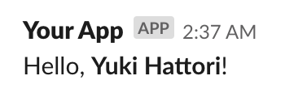
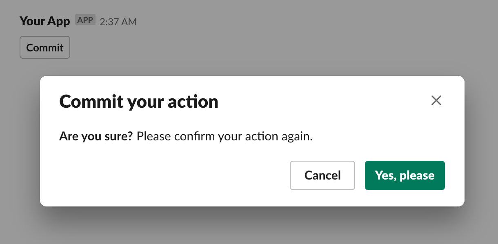

# jsx-slack

Build JSON objects for [Slack] API from readable HTML-like [JSX].

### :warning: Working in progress currently.

[slack]: https://slack.com
[jsx]: https://reactjs.org/docs/introducing-jsx.html
[block kit]: https://api.slack.com/block-kit
[block kit builder]: https://api.slack.com/tools/block-kit-builder

### Supports

- **[Block Kit as component](#block-kit-as-component)** - Building your blocks as component.
- **[HTML-like formatting](#html-like-formatting)** - Keep a readability by using well-known elements.

## Motivation

When developing Slack-integrated app, continuous maintenance of the rich contents is a difficult task. A team member must read and write JSON with deep knowledge about a specification of Slack messaging.

Slack has shipped [Block Kit] and [Block Kit Builder], and efforts to develop app easily. We believe JSX-based template would enhance a developer experience of Slack app to the next stage.

## Project goal

A project goal is creating an interface to build a maintainable Slack message with confidence via readable [JSX].

jsx-slack would allow building message blocks with predictable HTML-like markup. It helps in understanding the structure of the complex message.

## Block Kit as component

Slack has recommended to use **[Block Kit]** for building tempting message. By using jsx-slack, you can build a template with piling up Block Kit blocks by JSX. It is feeling like using components in React or Vue.

### Usage

At first, you have to setting JSX to use imported our parser `JSXSlack.h`. Typically, we recommend to use pragma comment `/* @jsx JSXSlack.h */`.

This is a simple block example `example.jsx` just to say hello to someone. Wrap JSX by `JSXSlack()` function.

```jsx
/** @jsx JSXSlack.h */
import JSXSlack, { Block, Section } from '@speee/jsx-slack'

export default function exampleBlock({ name }) {
  return JSXSlack(
    <Block>
      <Section>
        Hello, <b>{name}</b>!
      </Section>
    </Block>
  )
}
```

A prgama would work in Babel ([@babel/plugin-transform-react-jsx](https://babeljs.io/docs/en/babel-plugin-transform-react-jsx)) and [TypeScript >= 2.8 with `--jsx react`](https://www.typescriptlang.org/docs/handbook/jsx.html#factory-functions).

After than, just use created template in Slack API. We are using the official Node SDK [`@slack/client`](https://github.com/slackapi/node-slack-sdk) in this example. [See also Slack guide.](https://slackapi.github.io/node-slack-sdk/web_api)

```javascript
import { WebClient } from '@slack/client'
import exampleBlock from './example'

const web = new WebClient(process.env.SLACK_TOKEN)

web.chat
  .postMessage({
    channel: 'C1232456',
    blocks: exampleBlock({ name: 'Yuki Hattori' }),
  })
  .then(res => console.log('Message sent: ', res.ts))
  .catch(console.error)
```

It would post a simple Slack message like this:

[][block-kit-builder-example]

[ Preview in Block Kit Builder][block-kit-builder-example]

[block-kit-builder-example]: https://api.slack.com/tools/block-kit-builder?blocks=%5B%7B%22type%22%3A%22section%22%2C%22text%22%3A%7B%22type%22%3A%22mrkdwn%22%2C%22text%22%3A%22Hello%2C%20*Yuki%20Hattori*!%22%7D%7D%5D

## JSX component

### Blocks

#### `<Block>`

A container component to use Block Kit. You should wrap Block Kit elements by `<Block>`.

#### [`<Section>`: Section Block](https://api.slack.com/reference/messaging/blocks#section)

Display a simple text message. You have to specify the content as children. It allows [formatting with HTML-like elements](#html-like-formatting).

`<section>` intrinsic HTML element works as well.

```jsx
<Block>
  <Section>Hello, world!</Section>
</Block>
```

[ Preview in Block Kit Builder](https://api.slack.com/tools/block-kit-builder?blocks=%5B%7B%22type%22%3A%22section%22%2C%22text%22%3A%7B%22type%22%3A%22mrkdwn%22%2C%22text%22%3A%22Hello%2C%20world!%22%7D%7D%5D)

##### Props

- `id` / `blockId` (optional): A string of unique identifier of block.

#### [`<Divider>`: Divider Block](https://api.slack.com/reference/messaging/blocks#divider)

Just a divider. `<hr>` intrinsic HTML element works as well.

```jsx
<Block>
  <Divider />
</Block>
```

[ Preview in Block Kit Builder](https://api.slack.com/tools/block-kit-builder?blocks=%5B%7B%22type%22%3A%22divider%22%7D%5D)

##### Props

- `id` / `blockId` (optional): A string of unique identifier of block.

#### [`<Image>`: Image Block](https://api.slack.com/reference/messaging/blocks#image)

Display an image block. It has well-known props like `` HTML element.

`` intrinsic HTML element works as well.

```jsx
<Block>
  <Image src="http://placekitten.com/500/500" alt="So cute kitten." />
</Block>
```

[ Preview in Block Kit Builder](https://api.slack.com/tools/block-kit-builder?blocks=%5B%7B%22type%22%3A%22image%22%2C%22alt_text%22%3A%22So%20cute%20kitten.%22%2C%22image_url%22%3A%22http%3A%2F%2Fplacekitten.com%2F500%2F500%22%7D%5D)

##### Props

- `src` (**required**): The URL of the image.
- `alt` (**required**): A plain-text summary of the image.
- `title` (optional): An optional title for the image.
- `id` / `blockId` (optional): A string of unique identifier of block.

#### [`<Actions>`: Actions Block](https://api.slack.com/reference/messaging/blocks#actions)

A block to hold [interactive elements](#interactive-elements). Slack allows a maximum of 5 interactive elements in `<Actions>`.

##### Props

- `id` / `blockId` (optional): A string of unique identifier of block.

#### [`<Context>`: Context Block](https://api.slack.com/reference/messaging/blocks#context)

Display message context. It allows mixed contents consisted of the text and the `` tag image.

```jsx
<Block>
  <Context>
    
    A kitten and
    
    more kitten.
  </Context>
</Block>
```

[ Preview in Block Kit Builder](https://api.slack.com/tools/block-kit-builder?blocks=%5B%0A%09%7B%0A%09%09%22type%22%3A%20%22context%22%2C%0A%09%09%22elements%22%3A%20%5B%0A%09%09%09%7B%0A%09%09%09%09%22type%22%3A%20%22image%22%2C%0A%09%09%09%09%22image_url%22%3A%20%22http%3A%2F%2Fplacekitten.com%2F100%2F100%22%2C%0A%09%09%09%09%22alt_text%22%3A%20%22Kitten%22%0A%09%09%09%7D%2C%0A%09%09%09%7B%0A%09%09%09%09%22type%22%3A%20%22mrkdwn%22%2C%0A%09%09%09%09%22text%22%3A%20%22A%20kitten%20and%22%0A%09%09%09%7D%2C%0A%09%09%09%7B%0A%09%09%09%09%22type%22%3A%20%22image%22%2C%0A%09%09%09%09%22image_url%22%3A%20%22http%3A%2F%2Fplacekitten.com%2F100%2F100%22%2C%0A%09%09%09%09%22alt_text%22%3A%20%22Kitten%22%0A%09%09%09%7D%2C%0A%09%09%09%7B%0A%09%09%09%09%22type%22%3A%20%22mrkdwn%22%2C%0A%09%09%09%09%22text%22%3A%20%22more%20kitten.%22%0A%09%09%09%7D%0A%09%09%5D%0A%09%7D%0A%5D)

> :warning: Slack restricts the number of elements consisted of text content and image up to 10. jsx-slack throws error if the number of generated elements is going over the limit.

##### Props

- `id` / `blockId` (optional): A string of unique identifier of block.

### Interactive elements

Some blocks may include the interactive component to exchange info with Slack app.

#### [`<Button>`: Button element](https://api.slack.com/reference/messaging/block-elements#button)

A simple button to send action to registered Slack App, or open external URL.

##### Props

- `actionId` (optional): An identifier for the action.
- `value` (optional): A string value to send to Slack App when clicked button.
- `url` (optional): URL to load when clicked button.
- `confirm` (optional): [`<Confirm>` element](#confirm-confirmation-dialog) to show confirmation dialog.

#### [`<Select>`: Select menu with static options](https://api.slack.com/reference/messaging/block-elements#static-select)

A menu element with a static options passed by `<Option>` or `<Optgroup>`. It has a interface similar to `<select>` HTML element.

##### Props

- `actionId` (optional): An identifier for the action.
- `placeholder` (optional): A plain text to be shown at first.
- `confirm` (optional): [`<Confirm>` element](#confirm-confirmation-dialog) to show confirmation dialog.

##### `<Option>`: Menu item

###### Props

- `value` (**required**): A string value to send to Slack App when choose item.

##### `<Optgroup>`: Group of menu items

###### Props

- `label` (**required**): A plain text to be shown as a group name.

### Components for [composition objects](https://api.slack.com/reference/messaging/composition-objects)

#### [`<Confirm>`: Confirmation dialog](https://api.slack.com/reference/messaging/composition-objects#confirm)

Define confirmation dialog. Some interactive elements can open confirmation dialog when selected, by passing `<Confirm>` to `confirm` prop.

```jsx
<Block>
  <Actions>
    <Button
      actionId="commit"
      value="value"
      confirm={
        <Confirm title="Commit your action" confirm="Yes, please" deny="Cancel">
          <b>Are you sure?</b> Please confirm your action again.
        </Confirm>
      }
    >
      Commit
    </Button>
  </Actions>
</Block>
```

[][confirmation]

[ Preview in Block Kit Builder][confirmation]

[confirmation]: https://api.slack.com/tools/block-kit-builder?blocks=%5B%7B%22type%22%3A%22actions%22%2C%22elements%22%3A%5B%7B%22type%22%3A%22button%22%2C%22text%22%3A%7B%22type%22%3A%22plain_text%22%2C%22text%22%3A%22Commit%22%2C%22emoji%22%3Atrue%7D%2C%22action_id%22%3A%22commit%22%2C%22confirm%22%3A%7B%22title%22%3A%7B%22type%22%3A%22plain_text%22%2C%22text%22%3A%22Commit%20your%20action%22%2C%22emoji%22%3Atrue%7D%2C%22text%22%3A%7B%22type%22%3A%22mrkdwn%22%2C%22text%22%3A%22*Are%20you%20sure%3F*%20Please%20confirm%20your%20action%20again.%22%2C%22verbatim%22%3Afalse%7D%2C%22confirm%22%3A%7B%22type%22%3A%22plain_text%22%2C%22text%22%3A%22Yes%2C%20please%22%2C%22emoji%22%3Atrue%7D%2C%22deny%22%3A%7B%22type%22%3A%22plain_text%22%2C%22text%22%3A%22Cancel%22%2C%22emoji%22%3Atrue%7D%7D%2C%22value%22%3A%22value%22%7D%5D%7D%5D

##### Props

- `title` (**required**): The title of confirmation dialog.
- `confirm` (**required**): A text content of the button to confirm.
- `deny` (**required**): A text content of the button to cancel.

## HTML-like formatting

### :warning: This is a draft of specification. Current implementation might not fill these spec.

Slack can format message by very rational short syntaxes called `mrkdwn`. On the other hand, someone might yearn for a template engine with clear tag definition like HTML, especially when building a complex message.

jsx-slack has HTML-compatible JSX elements to format messages. It might be verbose as a text, but would give readablity by well-known HTML elements.

<!-- _You may also use a regular mrkdwn syntax via the attribute defined in block if these are unnecessary._ -->

### Format text style

- `<i>`, `<em>`: _Italic text_
- `<b>`, `<strong>`: **Bold text**
- `<s>`, `<del>`: ~~Strikethrough text~~

### Line breaks

As same as HTML, line breaks in JSX will be ignored even if you have multi-line JSX, and replace to a single whitespace. You shoud use `<br />` tag to break line inside JSX.

### HTML block contents

- `<p>` tag just makes a blank line around contents. Slack would render it as like as paragraph.
- `<blockquote>` adds `>` character to the first of each lines for highlighting as quote.
- `<pre>` tag will recognize the content as formatted-text, and wrapped content by ` ``` ` .

#### Unordered list simulation

We can simulate unordered list provided from `<ul>` tag by using mimicked text.

```html
<ul>
  <li>List A</li>
  <li>List B</li>
  <li>List C</li>
</ul>
```

The above would be replaced to just a plain text like this:

```
• List A
• List B
• List C
```

### Links

jsx-slack will not recognize URL-like as hyperlink. You should use `<a href="">` if you want using a link.

For example, `<a href="https://example.com/">Link</a>` will be converted to `<https://example.com/|Link>`, and rendered as like as "[Link](https://example.com)".

#### To Slack channel

`<a href="#C024BE7LR" />` means a link to Slack channel. You have to set **_PUBLIC_ channel's ID, not channel name,** as an anchor. [Refer details to documentation by Slack](https://api.slack.com/messaging/composing/formatting#linking-channels) for more details.

If defined what except URL as `href` attribute, _you cannot use a custom content because Slack would fill the content automatically._ Unlike HTML specification, `<a>` tag allows to use as void element `<a />`

#### Mention to user and user group

As like as channel link, `<a href="@U024BE7LH" />` means a mention to specified user.

jsx-slack can mention to user groups with a same syntax `<a href="@SAZ94GDB8" />` by detecting user group ID prefixed `S`.

Of course, we also support special mentions like `@here`, `@channel`, and `@everyone`.

### Date formatting

[Slack supports date formatting for localization by timezone.](https://api.slack.com/messaging/composing/formatting#date-formatting) jsx-slack also support it by HTML5 `<time>` tag.

```jsx
<time datetime="1392734382">{'Posted {date_num} {time_secs}'}</time>
// => "<!date^1392734382^Posted {date_num} {time_secs}>"

<time datetime="1392734382">{'{date} at {time}'}</time>
// => "<!date^1392734382^Posted {date_num} {time_secs}>"

<a href="https://example.com/">
  <time datetime="1392734382" fallback="Feb 18, 2014 PST">
    {'{date_short}'}
  </time>
</a>
// => "<!date^1392734382^{date_short}^https://example.com/>"
```

An optional fallback text may specify via additional `fallback` attribute.

### Correspondence table

#### Basics

|            jsx-slack             |     Slack mrkdwn      |
| :------------------------------: | :-------------------: |
|         `<i>Italic</i>`          |      `_Italic_`       |
|        `<em>Italic</em>`         |      `_Italic_`       |
|          `<b>Bold</b>`           |       `*Bold*`        |
|     `<strong>Bold</strong>`      |       `*Bold*`        |
|         `<s>Strike</s>`          |      `~Strike~`       |
|       `<del>Strike</del>`        |      `~Strike~`       |
|        `Line<br />break`         |     `Line\nbreak`     |
|      `<p>foo</p><p>bar</p>`      |     `foo\n\nbar`      |
| `<blockquote>quote</blockquote>` |       `>quote`        |
|       `<code>code</code>`        |     `` `code` ``      |
|     `<pre>code\nblock</pre>`     | ` ```code\nblock``` ` |
|     `<ul><li>List</li></ul>`     |       `• List`        |

#### Links

|                  jsx-slack                   |            Slack mrkdwn            |
| :------------------------------------------: | :--------------------------------: |
|  `<a href="https://example.com/">Link</a>`   |   `<https://example.com/\|Link>`   |
| `<a href="mailto:mail@example.com">Mail</a>` | `<mailto:mail@example.com/\|Mail>` |
|          `<a href="#C024BE7LR" />`           |          `<!#C024BE7LR>`           |
|          `<a href="@U024BE7LH" />`           |          `<!@U024BE7LH>`           |
|          `<a href="@SAZ94GDB8" />`           |       `<!subteam^SAZ94GDB8>`       |
|             `<a href="@here" />`             |          `<!here\|here>`           |
|           `<a href="@channel" />`            |       `<!channel\|channel>`        |
|           `<a href="@everyone" />`           |      `<!everyone\|everyone>`       |

## Similar projects

- [slack-jsx](https://github.com/zcei/slack-jsx) - Compose Slack messages from JSX Components instead of writing JSON.

## Author

Managed by [ Speee, Inc.](https://speee.jp) ([@speee](https://github.com/speee))

-  Yuki Hattori ([@yhatt](https://github.com/yhatt)) - Maintainer

## Licnese

[MIT License](LICENSE)
