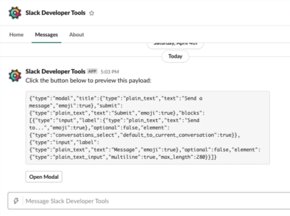

###### [Top](../README.md) &raquo; [JSX components for Block Kit](jsx-components-for-block-kit.md) &raquo; Block elements

# Block elements

Slack provides some **[block elements](https://api.slack.com/reference/block-kit/block-elements)** that may include in [layout blocks](layout-blocks.md). e.g. interactive components to exchange information with Slack app.

## Interactive components

### <a name="user-content-button" id="button"></a> [`<Button>`: Button element](https://api.slack.com/reference/messaging/block-elements#button)

A simple button to send action to registered Slack App, or open external URL. `<button>` intrinsic HTML element also works as well.

```jsx
<Blocks>
  <Actions>
    <Button actionId="action" value="value" style="primary">
      Action button
    </Button>
    <Button url="https://example.com/">Link to URL</Button>
    <Button actionId="close" value="close" style="danger" aria-label="Close">
      ❌
    </Button>
  </Actions>
</Blocks>
```

[](https://jsx-slack.netlify.app/#bkb:jsx:eJxtkEEKwjAQRfeeYpi9Zi9pwboSuhI8wDQNGpomJUnF3sEreDlPYkhqRXSV-UPmzWN4pa3ofLkC4DsRlDWpjqkaQ7AGKDUPbYG5QriSHmWB6UHwYdIxDU715CbMwwCZBU2CZCDLxG_86HSBlxAGv2VM3qgftNwI2zMsa2U6CBZOx_r_7EdNaOvlYjan2awlc5YOgZyitaZGxoX79OPt-nzcfww5W64R2_lGL0HxXz8=)

#### Props

- `name` / `actionId` (optional): An identifier for the action.
- `value` (optional): A string value to send to Slack App when clicked button.
- `url` (optional): URL to load when clicked button.
- `style` (optional): Select the color scheme of the button from `primary` and `danger`.
- `accessibilityLabel` / `aria-label` (optional): A string label for setting an accessible name of the button. This label will be read out by screen readers. (Up to 75 characters)
- `confirm` (optional): [Confirmation dialog object] or [`<Confirm>` element](#confirm) to show confirmation dialog. If the confirmation object has not defined `style` prop, the style for confirm button may be inherited from the assigned button.

[confirmation dialog object]: https://api.slack.com/reference/block-kit/composition-objects#confirm

#### <a name="user-content-workflow-button" id="workflow-button"></a> [`<WorkflowButton>`: Workflow button element](https://api.slack.com/reference/block-kit/block-elements#workflow_button) (Only for messaging)

Similar to `<Button>`, but for running a [link trigger](https://api.slack.com/automation/triggers/link#workflow_buttons) with customizable inputs. _This component is available only for [`<Blocks>` container](block-containers.md#user-content-blocks)._

```jsx
<Blocks>
  <Actions>
    <WorkflowButton
      actionId="action"
      style="primary"
      workflow={{
        trigger: {
          url: 'https://slack.com/shortcuts/Ft0123ABC456/321...zyx',
          customizable_input_parameters: [
            {
              name: 'input_parameter_a',
              value: 'Value for input param A'
            },
            {
              name: 'input_parameter_b',
              value: 'Value for input param B'
            }
          ]
        }
      }}
    >
      Run Workflow
    </WorkflowButton>
  </Actions>
</Blocks>
```

##### Props

- `workflow` (**required**): A raw [workflow object](https://api.slack.com/reference/block-kit/composition-objects#workflow) that contains details about the workflow that will run when the button is clicked.
- `name` / `actionId` (optional): An identifier for the action.
- `style` (optional): Select the color scheme of the button from `primary` and `danger`.
- `accessibilityLabel` / `aria-label` (optional): A string label for setting an accessible name of the button. This label will be read out by screen readers. (Up to 75 characters)

### <a name="user-content-select" id="select"></a> [`<Select>`: Select menu with static options](https://api.slack.com/reference/messaging/block-elements#static_select)

A menu element with static options passed by `<Option>` or `<Optgroup>`. It has a interface similar to `<select>` HTML element. In fact, `<select>` intrinsic HTML element works as well.

```jsx
<Blocks>
  <Actions>
    <Select actionId="rating" placeholder="Rate it!">
      <Option value="5">5 {':star:'.repeat(5)}</Option>
      <Option value="4">4 {':star:'.repeat(4)}</Option>
      <Option value="3">3 {':star:'.repeat(3)}</Option>
      <Option value="2">2 {':star:'.repeat(2)}</Option>
      <Option value="1">1 {':star:'.repeat(1)}</Option>
    </Select>
  </Actions>
</Blocks>
```

[](https://jsx-slack.netlify.app/#bkb:jsx:eJyVkE0KwjAQRveeYpwLhP5tShLQnStBTxDSQYOhKeno-a2JuGooboaZ4Xvf4smjD_Yx6x2APFh2YUz7cl3Jk2Uw6XkaFEbDbrwhTN5Yugc_UFR4MUzgeI-ZWrjz9AHgZfyTFHaoO-hnNrEvTSkyUmhoUbfFhg22Qd2ssBtUjbqGP_IV6grWklJkicmu-OmV4iv9DexCdbo=)

#### Props

- `name` / `actionId` (optional): An identifier for the action.
- `placeholder` (optional): A plain text to be shown at first.
- `value` (optional): A value of item to show initially. It must choose defined `value` from `<Option>` elements in children. It can pass multiple string values by array when `multiple` is enabled.
- `confirm` (optional): [Confirmation dialog object] or [`<Confirm>` element](#confirm) to show confirmation dialog.
- `autoFocus` (optional): Set whether the element will be set the focus automatically within the modal/home container.

#### Multiple select

By defining `multiple` attribute, you also can provide [the selectable menu from multiple options][multi-select] with an appearance is similar to button or text input. The same goes for other select-like components.

[multiple select]: #multiple-select
[multi-select]: https://api.slack.com/reference/block-kit/block-elements#multi_select

```jsx
<Blocks>
  <Section>
    What kind of dogs do you love? :dog:
    <Select
      actionId="dogs"
      multiple
      placeholder="Choose favorite dog(s)"
      value={['labrador', 'golden_retriver']}
    >
      <Option value="labrador">Labrador</Option>
      <Option value="german_shepherd">German Shepherd</Option>
      <Option value="golden_retriver">Golden Retriever</Option>
      <Option value="bulldog">Bulldog</Option>
    </Select>
  </Section>
</Blocks>
```

[](https://jsx-slack.netlify.app/#bkb:jsx:eJyFkbGKwzAMhvd7CuHpbspeHB-0QzkoFK5Dx-LGam2qRMF2An37sx1ztEPpYuRf-n7JllwTd7egPgDkAbvoeMgxwNHqCDc3GOALGL6GdMCdJyCe8RtWSVqVwoRRAksMoIvFj2lFZkRV-4miGwnrdSTdoWUy6FuxscwB4aJn9i5i7vUZvhZSVUDux2wLs6YJW0H67LVhLyCU3mjUrkqyWUpfkFf0vR5OweJo0RuhtkWAQxXe4Xnm4eQxejfjY_9tycBvzmBKvTE6T0TpoUKtl-C5XDbLn5atNP9rkU1d1h__ZYum)

> :warning: **Slack does not allow to place the multi-select menu in `Actions` block.** So jsx-slack throws error if you're trying to use `multiple` attribute in the children of `<Actions>`.

##### Props for [multiple select]

- `multiple` (optional): A boolean value that shows whether multiple options can be selected.
- `maxSelectedItems` (optional): A maximum number of items to allow selected.

#### As [an input component](#input-components)

By passing suitable props such as required `label` prop, select-like components will work as [input components](#input-components) well. Thereby it would allow natural templating like as HTML form.

```jsx
<Modal title="Programming survey">
  <Select
    label="Language"
    name="language"
    title="Pick language you want to learn."
    required
  >
    <Option value="javascript">JavaScript</Option>
    <Option value="python">Python</Option>
    <Option value="java">Java</Option>
    <Option value="c-sharp">C#</Option>
    <Option value="php">PHP</Option>
  </Select>
</Modal>
```

[](https://jsx-slack.netlify.app/#bkb:jsx:eJx9kMEKwjAMhu8-Rahn3Qt0vXgRURzsCWIXtmrXzq6d7O2tLQMF2Sl__nz5A-EX26AGr7ymklXOtg77XpkWxuAmmpnYAPCaNEkfFYDGG-mSndG0AVtiyTTYx2394y2RSj5gmcBsA7zQePAWNKEz-ww7egblqImNSAa_Dl5ZAxPqEFPuOOEonRo8E6eo66R5kam_K8PsO2uYqFJdRT_pOXcVk7uxQzcwcdiuX-4iUx2rb4gX-Ydiw4v0cvEGXNR5RA==)

The above JSX means exactly same as following usage of [`<Input>` layout block](layout-blocks.md#user-content-input):

<!-- prettier-ignore-start -->

```jsx
<Modal title="Programming survey">
  <Input label="Language" title="Pick language you want to learn." required>
    <Select actionId="language">
      ...
    </Select>
  </Input>
</Modal>
```

<!-- prettier-ignore-end -->

##### Props for an input component

- `label` (**required**): The label string for the element.
- `id` / `blockId` (optional): A string of unique identifier of [`<Input>` layout block](layout-blocks.md#user-content-input).
- `title`/ `hint` (optional): Specify a helpful text appears under the element.
- `required` (optional): A boolean prop to specify whether any value must be filled when user confirms modal.
- `dispatchAction` (optional): By setting `true`, the input element will dispatch [`block_actions` payload](https://api.slack.com/reference/interaction-payloads/block-actions) when used this.

### <a name="user-content-option" id="option"></a> `<Option>`: Menu item

Define an item for `<Select>`. `<option>` intrinsic HTML element works as well.

#### Props

- `value` (optional): A string value to send to Slack App when choose item. Use its content string as value if omitted.
- `selected` (optional): A boolean value to indicate initially selected option(s). _It will work only when the parent `<Select>` did not define `value` prop._
- `description` (optional): A string value for the secondary description label of the item. The description appears next to the item label in small gray text. It must up to 75 characters.

### <a name="user-content-optgroup" id="optgroup"></a> `<Optgroup>`: Group of menu items

Define a group for `<Select>`. `<optgroup>` intrinsic HTML element works as well.

```jsx
<Blocks>
  <Actions>
    <Select actionId="action" placeholder="Action...">
      <Optgroup label="Search with">
        <Option value="search_google">Google</Option>
        <Option value="search_bing">Bing</Option>
        <Option value="search_duckduckgo">DuckDuckGo</Option>
      </Optgroup>
      <Optgroup label="Share to">
        <Option value="share_facebook">Facebook</Option>
        <Option value="share_twitter">Twitter</Option>
      </Optgroup>
    </Select>
  </Actions>
</Blocks>
```

[](https://jsx-slack.netlify.app/#bkb:jsx:eJyNkU0OgjAQhfeeopkD0AuUJhIjceUC96SUsRAah5Si17e0hIWJ4mI6b5r3JfMjCkt6mOSBMXHUvqdH1KGq0KL2TMXPS5tDUsBGqzR2ZFt0OSQmyzJIWACvozeO5pFZ1aDNoULldMdeve82U7IFkj2VnTGHKZpqQ2QsgixjFjyZ9qimfxiQRXj_JdpZD0sYAnkKeYmSPulYx1m-D9cph8zTj8kWR30PO2uIBpDnVe23GkEf9ubRgbwlsdej4Olw8aJ8O6ng66Hf3Gyc2A==)

#### Props

- `label` (**required**): A plain text to be shown as a group name.

### <a name="user-content-external-select" id="external-select"></a> [`<ExternalSelect>`: Select menu with external data source](https://api.slack.com/reference/messaging/block-elements#external_select)

You should use `<ExternalSelect>` if you want to provide the dynamic list from external source.

It requires setup JSON entry URL in your Slack app. [Learn about external source in Slack documentation.](https://api.slack.com/reference/messaging/block-elements#external_select)

```jsx
<Blocks>
  <Actions>
    <ExternalSelect
      actionId="category"
      placeholder="Select category..."
      minQueryLength={2}
    />
  </Actions>
</Blocks>
```

[](https://jsx-slack.netlify.app/#bkb:jsx:eJyzccrJT84utuNSULBxTC7JzM8Ds4E814qS1KK8xJzg1JzU5BKwmIJCIliJZ4qtUnJiSWp6flGlElSmICcxOTUjPycltchWCaJHAaZGT08Ppiw3My-wNLWo0ic1L70kw1bJCCKhD3aAPtwFNvpQdwEAS3Mv5g==)

#### Props

- `name` / `actionId` (optional): An identifier for the action.
- `placeholder` (optional): A plain text to be shown at first.
- `initialOption` / `value` (optional): An initial option exactly matched to provided options from external source. It allows raw JSON object or `<Option>`. It can pass multiple options by array when `multiple` is enabled.
- `minQueryLength` (optional): A length of typed characters to begin JSON request.
- `confirm` (optional): [Confirmation dialog object] or [`<Confirm>` element](#confirm) to show confirmation dialog.
- `autoFocus` (optional): Set whether the element will be set the focus automatically within the modal/home container.

##### Props for [multiple select]

- `multiple` (optional): A boolean value that shows whether multiple options can be selected.
- `maxSelectedItems` (optional): A maximum number of items to allow selected.

##### Props for an input component

- `label` (**required**): The label string for the element.
- `id` / `blockId` (optional): A string of unique identifier of [`<Input>` layout block](layout-blocks.md#user-content-input).
- `title`/ `hint` (optional): Specify a helpful text appears under the element.
- `required` (optional): A boolean prop to specify whether any value must be filled when user confirms modal.
- `dispatchAction` (optional): By setting `true`, the input element will dispatch [`block_actions` payload](https://api.slack.com/reference/interaction-payloads/block-actions) when used this.

### <a name="user-content-select-fragment" id="select-fragment"></a> `<SelectFragment>`: Generate options for external source

You may think want to build also the data source through jsx-slack. `<SelectFragment>` component can create JSON object for external data source usable in `<ExternalSelect>`.

#### Example

A following is a super simple example to serve JSON for external select via [express](https://expressjs.com/). It is using [`jsxslack` tagged template literal](../README.md#user-content-quick-start-template-literal).

```javascript
import { jsxslack } from 'jsx-slack'
import express from 'express'

const app = express()

app.get('/external-data-source', (req, res) => {
  res.json(jsxslack`
    <SelectFragment>
      <Option value="item-a">Item A</Option>
      <Option value="item-b">Item B</Option>
      <Option value="item-c">Item C</Option>
    </SelectFragment>
  `)
})

app.listen(80)
```

### <a name="user-content-users-select" id="users-select"></a> [`<UsersSelect>`: Select menu with user list](https://api.slack.com/reference/messaging/block-elements#users_select)

A select menu with options consisted of users in the current workspace.

#### Props

- `name` / `actionId` (optional): An identifier for the action.
- `placeholder` (optional): A plain text to be shown at first.
- `initialUser` / `value` (optional): The initial user ID. It can pass multiple string values by array when `multiple` is enabled.
- `confirm` (optional): [Confirmation dialog object] or [`<Confirm>` element](#confirm) to show confirmation dialog.
- `autoFocus` (optional): Set whether the element will be set the focus automatically within the modal/home container.

##### Props for [multiple select]

- `multiple` (optional): A boolean value that shows whether multiple options can be selected.
- `maxSelectedItems` (optional): A maximum number of items to allow selected.

##### Props for an input component

- `label` (**required**): The label string for the element.
- `id` / `blockId` (optional): A string of unique identifier of [`<Input>` layout block](layout-blocks.md#user-content-input).
- `title`/ `hint` (optional): Specify a helpful text appears under the element.
- `required` (optional): A boolean prop to specify whether any value must be filled when user confirms modal.
- `dispatchAction` (optional): By setting `true`, the input element will dispatch [`block_actions` payload](https://api.slack.com/reference/interaction-payloads/block-actions) when used this.

### <a name="user-content-conversations-select" id="conversations-select"></a> [`<ConversationsSelect>`: Select menu with conversations list](https://api.slack.com/reference/messaging/block-elements#conversation_select)

A select menu with options consisted of any type of conversations in the current workspace.

#### Props

- `name` / `actionId` (optional): An identifier for the action.
- `placeholder` (optional): A plain text to be shown at first.
- `initialConversation` / `value` (optional): The initial conversation ID, or a special value `current`. It can pass multiple string values by array when `multiple` is enabled.
- `include` (optional): An array of the kind or a string of space-separated kinds, to indicate which kind of conversation types are included in list. By default, all conversation types are included.
  - `public`: Public channel
  - `private`: Private channel
  - `im`: Direct message
  - `mpim`: Group direct message
- `excludeExternalSharedChannels` (optional): A boolean value whether to exclude external [shared channels](https://api.slack.com/enterprise/shared-channels) from conversations list.
- `excludeBotUsers` (optional): A boolean value whether to exclude bot users from conversations list.
- `confirm` (optional): [Confirmation dialog object] or [`<Confirm>` element](#confirm) to show confirmation dialog.
- `autoFocus` (optional): Set whether the element will be set the focus automatically within the modal/home container.

##### Props for [multiple select]

- `multiple` (optional): A boolean value that shows whether multiple options can be selected.
- `maxSelectedItems` (optional): A maximum number of items to allow selected.

##### Props for an input component

- `label` (**required**): The label string for the element.
- `id` / `blockId` (optional): A string of unique identifier of [`<Input>` layout block](layout-blocks.md#user-content-input).
- `title`/ `hint` (optional): Specify a helpful text appears under the element.
- `required` (optional): A boolean prop to specify whether any value must be filled when user confirms modal.
- `dispatchAction` (optional): By setting `true`, the input element will dispatch [`block_actions` payload](https://api.slack.com/reference/interaction-payloads/block-actions) when used this.
- `responseUrlEnabled` (optional): A boolean prop whether include extra `response_urls` field to the `view_submission` event callback, for responding into selected channel via unique URL entrypoint. _This is only available in modal's input component and cannot coexist with `multiple` prop._

#### Special initial conversation: `current`

jsx-slack accepts a special value `current` as an initial conversation. It indicates the origin conversation that the container surface belongs to.

For example, `<ConversationsSelect initialConversation="current" />` in the modal will initially select the conversation that triggered opening the modal.

```jsx
<Modal title="Send a message">
  <ConversationsSelect
    label="Send to..."
    initialConversation="current"
    required
  />
  <Textarea label="Message" maxLength={280} required />
</Modal>
```

[](https://jsx-slack.netlify.app/#bkb:jsx:eJxNjjEOwjAUQ3dO8ZUDpIiJIenCSqf2Ap_GKpHSRCS_qMenhIIYbfnZNl1yHEi8BFjVIzpimlEKT1DtgchcUnwiFxafYukRMMpmEwW-IeyIJK21qraPXjyHf8qqcckZUT6JjMfiM9wmmrowYBXO4G9lt8_TzOsVcZK7VafzUf3IN2ea-rx9Ach6PgE=)

By previewing the above JSX through [Slack Developer Tools](https://devtools.builtbyslack.com/), you can confirm its conversation is initially selected.



> :warning: `current` actually corresponds to [`default_to_current_conversation` field](https://api.slack.com/reference/block-kit/block-elements#conversation_multi_select) in Slack API. It will be ignored if defined initial conversations, so _multiple conversations select cannot specify `current` along with specific conversations_.

### <a name="user-content-channels-select" id="channels-select"></a> [`<ChannelsSelect>`: Select menu with channel list](https://api.slack.com/reference/messaging/block-elements#channel_select)

A select menu with options consisted of public channels in the current workspace.

#### Props

- `name` / `actionId` (optional): An identifier for the action.
- `placeholder` (optional): A plain text to be shown at first.
- `initialChannel` / `value` (optional): The initial channel ID. It can pass multiple string values by array when `multiple` is enabled.
- `confirm` (optional): [Confirmation dialog object] or [`<Confirm>` element](#confirm) to show confirmation dialog.irmation dialog.
- `autoFocus` (optional): Set whether the element will be set the focus automatically within the modal/home container.

##### Props for [multiple select]

- `multiple` (optional): A boolean value that shows whether multiple options can be selected.
- `maxSelectedItems` (optional): A maximum number of items to allow selected.

##### Props for an input component

- `label` (**required**): The label string for the element.
- `id` / `blockId` (optional): A string of unique identifier of [`<Input>` layout block](layout-blocks.md#user-content-input).
- `title`/ `hint` (optional): Specify a helpful text appears under the element.
- `required` (optional): A boolean prop to specify whether any value must be filled when user confirms modal.
- `dispatchAction` (optional): By setting `true`, the input element will dispatch [`block_actions` payload](https://api.slack.com/reference/interaction-payloads/block-actions) when used this.
- `responseUrlEnabled` (optional): A boolean prop whether include extra `response_urls` field to the `view_submission` event callback, for responding into selected channel via unique URL entrypoint. _This is only available in modal's input component and cannot coexist with `multiple` prop._

### <a name="user-content-overflow" id="overflow"></a> [`<Overflow>`: Overflow menu](https://api.slack.com/reference/messaging/block-elements#overflow)

An overflow menu displayed as `...` can access to some hidden menu items. It must contain 1 to 5 `<OverflowItem>` component(s).

```jsx
<Blocks>
  <Actions>
    <Overflow actionId="overflow_menu">
      <OverflowItem value="share">Share</OverflowItem>
      <OverflowItem value="reply">Reply message</OverflowItem>
      <OverflowItem url="https://example.com/">Open in browser</OverflowItem>
    </Overflow>
  </Actions>
</Blocks>
```

[](https://jsx-slack.netlify.app/#bkb:jsx:eJyNkDsOwjAQRHtOsdoD4B7ZlqBLFQkOEBmzkAj_5E8Ct4eECFIgRDWzTzNbDN8Zr69JrgD4VufOu8k_r7qneDZ-ADXh6iTQz6ix5Aq-cotklclCr0whgalVkVAeRuFsmfhZixTMHeV-FLCUkrr8VS_RCGxzDmnDGN2UDYbW2luGsg7koHNwjH5IFL99-7BpB_YegrN5nge2wGJC)

#### Props

- `name` / `actionId` (optional): An identifier for the action.
- `confirm` (optional): [Confirmation dialog object] or [`<Confirm>` element](#confirm) to show confirmation dialog.

### <a name="user-content-overflow-item" id="overflow-item"></a> `<OverflowItem>`: Menu item in overflow menu

#### Props

- `value` (optional): A string value to send to Slack App when choose item.
- `url` (optional): URL to load when clicked button.

### <a name="user-content-date-picker" id="date-picker"></a> [`<DatePicker>`: Select date from calendar](https://api.slack.com/reference/messaging/block-elements#datepicker)

An easy way to let the user selecting any date is using `<DatePicker>` component.

```jsx
<Blocks>
  <Actions>
    <DatePicker actionId="date_picker" initialDate={new Date()} />
  </Actions>
</Blocks>
```

[](https://jsx-slack.netlify.app/#bkb:jsx:eJyzccrJT84utuNSULBxTC7JzM8Ds4E8l8SS1IDM5OzUIoVEsIRniq1SClAwvgAsqqSQmZdZkpmYA1Joq2RkYGipa2Cka2SkpKAPNk4fbp6NPtQWAHYmIa4=)

#### Props

- `name` / `actionId` (optional): An identifier for the action.
- `placeholder` (optional): A plain text to be shown at first.
- `initialDate` / `value` (optional): An initially selected date. It allows `YYYY-MM-DD` formatted string, UNIX timestamp in millisecond, and JavaScript [`Date`](https://developer.mozilla.org/en-US/docs/Web/JavaScript/Reference/Global_Objects/Date) instance.
- `confirm` (optional): [Confirmation dialog object] or [`<Confirm>` element](#confirm) to show confirmation dialog.
- `autoFocus` (optional): Set whether the element will be set the focus automatically within the modal/home container.

#### As [an input component](#input-components)

`<DatePicker>` also will work as [input components](#input-components) by passing required `label` prop.

```jsx
<Modal title="My App">
  <DatePicker label="Date" name="date" />
</Modal>
```

[](https://jsx-slack.netlify.app/#bkb:jsx:eJyz8c1PScxRKMksyUm1VfKtVHAsKFCy41JQsHFJLEkNyEzOTi1SyElMSs2xVQKJKCnkJeYCVaaA2fp2XDb6YBPsAFtcFsA=)

##### Props for an input component

- `label` (**required**): The label string for the element.
- `id` / `blockId` (optional): A string of unique identifier of [`<Input>` layout block](layout-blocks.md#user-content-input).
- `title`/ `hint` (optional): Specify a helpful text appears under the element.
- `required` (optional): A boolean prop to specify whether any value must be filled when user confirms modal.
- `dispatchAction` (optional): By setting `true`, the input element will dispatch [`block_actions` payload](https://api.slack.com/reference/interaction-payloads/block-actions) when used this.

### <a name="user-content-time-picker" id="time-picker"></a> [`<TimePicker>`: Select time through picker](https://api.slack.com/reference/messaging/block-elements#timepicker)

`<TimePicker>` component lets users input or select a specific time easily.

```jsx
<Blocks>
  <Actions>
    <TimePicker actionId="time_picker" initialTime={new Date()} />
  </Actions>
</Blocks>
```

[](https://jsx-slack.netlify.app/#bkb:jsx:eJyzccrJT84utuNSULBxTC7JzM8Ds4G8kMzc1IDM5OzUIoVEsIRniq1SCVAwvgAsqqSQmZdZkpmYA1Joq2RoZGVsrqSgDzZJH26UjT7UAgDo1SD8)

#### Props

- `name` / `actionId` (optional): An identifier for the action.
- `placeholder` (optional): A plain text to be shown at first.
- `initialTime` / `value` (optional): An initially selected time. It accepts `HH:mm` formatted string, and a value that points out designated datetime: UNIX timestamp in millisecond or JavaScript [`Date`](https://developer.mozilla.org/en-US/docs/Web/JavaScript/Reference/Global_Objects/Date) instance.
- `confirm` (optional): [Confirmation dialog object] or [`<Confirm>` element](#confirm) to show confirmation dialog.
- `autoFocus` (optional): Set whether the element will be set the focus automatically within the modal/home container.

#### As [an input component](#input-components)

```jsx
<Home>
  <TimePicker label="Time" name="time" required dispatchAction />
</Home>
```

[](https://jsx-slack.netlify.app/#bkb:jsx:eJyz8cjPTbXjUlCwCcnMTQ3ITM5OLVLISUxKzbFVAokoKeQl5qbaKpWA2UWphaWZRakpCimZxQWJJckZjsklmfl5Cvp2XDb6YJMALlUasA==)

##### Props for an input component

- `label` (**required**): The label string for the element.
- `id` / `blockId` (optional): A string of unique identifier of [`<Input>` layout block](layout-blocks.md#user-content-input).
- `title`/ `hint` (optional): Specify a helpful text appears under the element.
- `required` (optional): A boolean prop to specify whether any value must be filled when user confirms modal.
- `dispatchAction` (optional): By setting `true`, the input element will dispatch [`block_actions` payload](https://api.slack.com/reference/interaction-payloads/block-actions) when used this.

### <a name="user-content-date-time-picker" id="date-time-picker"></a> [`<DateTimePicker>`: Select date and time through picker](https://api.slack.com/reference/block-kit/block-elements#datetimepicker)

`<DateTimePicker>` provides a pair of pickers for the date and the time at once.

```jsx
<Blocks>
  <Actions>
    <DateTimePicker actionId="date_time_picker" initialDateTime={new Date()} />
  </Actions>
</Blocks>
```

[](https://jsx-slack.netlify.app/#bkb:jsx:eJyzccrJT84utuNSULBxTC7JzM8Ds4E8l8SS1JDM3NSAzOTs1CKFRLCkZ4qtUgpQIr4EKBNfAJZSUsjMyyzJTMyB6bBVMjIwMtI1NNA1sgwxMLIyNrcyMIhSUtAH26IPt8ZGH2o5ACUPKSg=)

#### Props

- `name` / `actionId` (optional): An identifier for the action.
- `initialDateTime` / `value` (optional): An initially selected date and time. It accepts a formatted string with ISO 8601 (`YYYY-MM-DDTHH:mm:ss.sssZ`), UNIX timestamp _in millisecond_, and JavaScript [`Date`](https://developer.mozilla.org/en-US/docs/Web/JavaScript/Reference/Global_Objects/Date) instance.
- `confirm` (optional): [Confirmation dialog object] or [`<Confirm>` element](#confirm) to show confirmation dialog.
- `autoFocus` (optional): Set whether the element will be set the focus automatically within the modal/home container.

#### As [an input component](#input-components)

```jsx
<Modal title="My App">
  <DateTimePicker label="Date and time" name="datetime" required />
</Modal>
```

[](https://jsx-slack.netlify.app/#bkb:jsx:eJyz8c1PScxRKMksyUm1VfKtVHAsKFCy41JQsHFJLEkNycxNDchMzk4tUshJTErNsVUCiSok5qUAdeSmKinkJeYCtaUABSH8otTC0syi1BQFfTsuG32w2XYAXOQgoQ==)

##### Props for an input component

- `label` (**required**): The label string for the element.
- `id` / `blockId` (optional): A string of unique identifier of [`<Input>` layout block](layout-blocks.md#user-content-input).
- `title`/ `hint` (optional): Specify a helpful text appears under the element.
- `required` (optional): A boolean prop to specify whether any value must be filled when user confirms modal.
- `dispatchAction` (optional): By setting `true`, the input element will dispatch [`block_actions` payload](https://api.slack.com/reference/interaction-payloads/block-actions) when used this.

### <a name="user-content-checkbox-group" id="checkbox-group"></a> [`<CheckboxGroup>`: Checkbox group](https://api.slack.com/reference/block-kit/block-elements#checkboxes)

A container for grouping checkboxes.

```jsx
<Home>
  <Section>
    <b>ToDo List</b>
    <CheckboxGroup actionId="todo">
      <Checkbox value="xxx-0001">
        <b>Learn about Slack app</b> (
        <time dateTime={new Date(2020, 1, 24)}>{'{date}'}</time>)
        <small>
          <i>
            XXX-0001: <b>High</b>
          </i>
        </small>
      </Checkbox>
      <Checkbox value="xxx-0002">
        <b>Learn about jsx-slack</b> (
        <time dateTime={new Date(2020, 1, 27)}>{'{date}'}</time>)
        <small>
          <i>
            XXX-0002: <b>Medium</b>
          </i>
        </small>
      </Checkbox>
      <Checkbox value="xxx-0003" checked>
        <s>
          <b>Prepare development environment</b> (
          <time dateTime={new Date(2020, 1, 21)}>{'{date}'}</time>)
        </s>
        <small>
          <i>
            XXX-0003: <b>Medium</b>
          </i>
        </small>
      </Checkbox>
    </CheckboxGroup>
  </Section>
</Home>
```

[](https://jsx-slack.netlify.app/#bkb:jsx:eJy1k89LwzAUx-_-FY-c9DDSZsqmpLkoOGGCMA-9pu3DxbVNadJSEP93mzjb7rCJMG_vxzffl8-Dx1e6QHEBwDeYWqVLF_dZIl71g4a1MpbTZF-832K6S3T3WOumAun1T1lErM40-dZMVNDKvMGIdF03C4IgHBTefo2yLkEmurGwyWW6A1lVbhRccqsKhExadEFEwpslu170FgERH678yanriKvR0BQyz8cBfUVNM4A4jv0v7tzwlXrbDlh7PZ084PTAj9Mfpt8g2XHId9PNjAM9Drlgt-wckMxDPmOmmuJfMOcEUtfBbGJmDuYk4qXGStY9I7aY66rA0gKWrap16eLja2BhsDy1BmrE33cyP89Oxtwfgb8cOpwOp_6cvgAwn91k)

#### Props

- `name` / `actionId` (optional): An identifier for the action.
- `values` (optional): An array of value for initially selected checkboxes. They must match to `value` property in `<Checkbox>` elements in children.
- `confirm` (optional): [Confirmation dialog object] or [`<Confirm>` element](#confirm) to show confirmation dialog.
- `autoFocus` (optional): Set whether the element will be set the focus automatically within the modal/home container.

#### As [an input component](#input-components)

```jsx
<Modal title="Quick survey">
  <CheckboxGroup
    id="foods"
    name="foods"
    label="What do you want to eat for the party in this Friday?"
    required
  >
    <Checkbox value="burger">Burger :hamburger:</Checkbox>
    <Checkbox value="pizza">Pizza :pizza:</Checkbox>
    <Checkbox value="taco">Tex-Mex taco :taco:</Checkbox>
    <Checkbox value="sushi">Sushi :sushi:</Checkbox>
    <Checkbox value="others">
      Others
      <small>
        <i>Let me know in the below form.</i>
      </small>
    </Checkbox>
  </CheckboxGroup>
  <Input type="text" id="others" name="others" label="What do you want?" />
</Modal>
```

[](https://jsx-slack.netlify.app/#bkb:jsx:eJyFks1OwzAQhO99ipHvkHvkuBJIICQqQCBxdpotseLEwT9t0qfHcRqgh6oXr76xx17tmG9MJTW88poK9hbUtoELdk8jEyuA39e0bUozPFoT-igAqirYzpjKsYSdbOlM0LIkXbDPWnpUBqMJOMjOwxtQlHbGwteEXlo_QnURlMODVZUc1_MNlr6DslRFEEn47QJ7qUN8rgz2iywTd6kir2U7SznPlrMXrL06HiUTr1NBnui6ycutYeKDhpsNDZgI-bRed7rgasXE-1SQJ7puMnFA1rF5F3hJeALuWqn1shVZiWfyaAlNZw7zQAkxgghx1u0tz9Rymmf_zOdd_FFKOklPXR9ibmM_TYAGz1L2p-ZOwS90IfU1QyZWPEu_TPwAz_3ERA==)

##### Props for an input component

- `label` (**required**): The label string for the group.
- `id` / `blockId` (optional): A string of unique identifier of [`<Input>` layout block](layout-blocks.md#user-content-input).
- `title`/ `hint` (optional): Specify a helpful text appears under the group.
- `required` (optional): A boolean prop to specify whether any value must be filled when user confirms modal.
- `dispatchAction` (optional): By setting `true`, the input element will dispatch [`block_actions` payload](https://api.slack.com/reference/interaction-payloads/block-actions) when used this.

### <a name="user-content-checkbox" id="checkbox"></a> `<Checkbox>`: Checkbox

A checkbox item. It must place in the children of `<CheckboxGroup>`.

It supports raw [mrkdwn format](https://api.slack.com/reference/surfaces/formatting) / [HTML-like formatting](./html-like-formatting.md) in the both of contents and `description` property.

```jsx
<Checkbox
  value="checkbox"
  description={
    <>
      XXX-1234 - <i>by Yuki Hattori</i>
    </>
  }
>
  <b>Checkbox item</b>: foobar
</Checkbox>
```

[](https://jsx-slack.netlify.app/#bkb:jsx:eJxlj80KwjAQhO8-xdJ7Wfw5yRoQD_YR4jEpEZcmrqSJ6NtbtX_ibWf5hpmhSoJTCwDa14nl2r7vTh0urm6sPI5R8u37m33hbnx2u6LudTEQHWPVSHFygdCqLZxFrIkT1Abj_WQC0FqXy9V6AyUQK_uEU24YKpOSRCbkWQD-mAmHuL45_lUnHLcRfva-AG1pRKg=)

> :information_source: [Links and mentions through `<a>` tag](https://github.com/yhatt/jsx-slack/blob/main/docs/html-like-formatting.md#user-content-links) will be ignored by Slack.

#### Props

- `value` (**required**): A string value to send to Slack App when choosing the checkbox.
- `description` (optional): A description string or JSX element for the current checkbox. It can see with faded color just below the main label. `<Checkbox>` prefers this prop than redirection by `<small>`.
- `checked` (optional): A boolean value indicating the initial state of the checkbox. _It will work only when the parent `<CheckboxGroup>` did not define `values` prop._

#### Redirect `<small>` into description

`<Checkbox>` allows `<small>` element for ergonomic templating, to redirect the content into description when `description` prop is not defined.

A below checkbox is meaning exactly the same as an example shown earlier.

```jsx
<Checkbox value="checkbox">
  <b>Checkbox item</b>: foobar
  <small>
    XXX-1234 - <i>by Yuki Hattori</i>
  </small>
</Checkbox>
```

### <a name="user-content-radio-button-group" id="radio-button-group"></a> [`<RadioButtonGroup>`: Radio button group](https://api.slack.com/reference/block-kit/block-elements#radio)

A container for grouping radio buttons.

```jsx
<Home>
  <Section>
    Select the tier of our service:
    <RadioButtonGroup actionId="tier" value="free">
      <RadioButton value="free" description="$0!">
        <b>Free</b>
      </RadioButton>
      <RadioButton
        value="standard"
        description={
          <Fragment>
            $5/month, <b>and 30 days trial!</b>
          </Fragment>
        }
      >
        <b>Standard</b>
      </RadioButton>
      <RadioButton value="premium" description="$30/month">
        <b>Premium</b>
      </RadioButton>
      <RadioButton
        value="business"
        description={<i>Please contact to support.</i>}
      >
        <b>Business</b>
      </RadioButton>
    </RadioButtonGroup>
  </Section>
</Home>
```

[](https://jsx-slack.netlify.app/#bkb:jsx:eJydkrtuAyEQRft8xRi5jMJKVpqI3cKFk3RW9gvYZSwj8RIPS_n7AGttTIq8Ori69zCMLnuxGoc7ADbiHKU15QwwospXiGeEKNGDPYFNHgL6i5zxqXrYGxfS7lOM1jx7mxzwSngVPSkhAheuEvbk5BHJwm1TjQEEhtlLVxA92XabNZJD03DIHkanFUNvON-xQ-RGcC9a2nhVb4hZD5or9XkH2D5SbU0835dMTsCuA8HfA0Qvudq0adrEfz2g86hl0l__v-uWp9u5j4v5P4uYUpAGQ2iB-6v6wyKYHI4KeUCY81C8VMNCSM5ZHx8YlX9ZQyPV4tT-0bWAjNZSfgDbYMF4)

#### Props

- `name` / `actionId` (optional): An identifier for the action.
- `value` (optional): A value for initially selected option. It must match to `value` property in one of `<RadioButton>` elements in children.
- `confirm` (optional): [Confirmation dialog object] or [`<Confirm>` element](#confirm) to show confirmation dialog.
- `autoFocus` (optional): Set whether the element will be set the focus automatically within the modal/home container.

#### As [an input component](#input-components)

`<RadioButtonGroup>` as an input component can place as the direct child of container by passing `label` prop.

```jsx
<Modal title="Preferences" close="Cancel">
  <RadioButtonGroup
    label="Notifications"
    id="notifications"
    name="notifications"
    title="Setting a frequency of notifications by app."
    value="all"
    required
  >
    <RadioButton value="all">
      All events
      <small>Notify all received events every time.</small>
    </RadioButton>
    <RadioButton value="summary">
      Daily summary
      <small>Send a daily summary at AM 9:30 every day.</small>
    </RadioButton>
    <RadioButton value="off">Off</RadioButton>
  </RadioButtonGroup>
  <Input type="submit" value="OK" />
</Modal>
```

[](https://jsx-slack.netlify.app/#bkb:jsx:eJydUttKxDAQfd-vGPIBW8EnpQ2sCiKyrrhfMG0mSyBNajIt5O_NplW6rL74FOZcck4u9d4rtMCGLTXiPZCmQK6jKKCzPmbsEfNohdwA1B-ojH8Ymb17Dn4cMgZgsSXbiDfPRpsO2XgXRWGMaoS7hh329CuxtDgSs3EnQNCBPsdcJ4HXcGGANgEOw3Y2TmjHbERr5_lsM4FUHmQB1s3X6pkF2FkLNJHjuAB17DMvy6FyUqYDdWQmUovuvISUK_e0ratZPUdVq6y_0-PY9xjST4MnNDbBgl6WOJJT-TLUWgHIsNvD3f3tzdJEYfpXEa-1kAetr-QXQHnugr64YWTgNJRDtL1h8b3V4VVAJTd1VT6V_AJi8MGk)

##### Props for an input component

- `label` (**required**): The label string for the group.
- `id` / `blockId` (optional): A string of unique identifier of [`<Input>` layout block](layout-blocks.md#user-content-input).
- `title`/ `hint` (optional): Specify a helpful text appears under the group.
- `required` (optional): A boolean prop to specify whether any value must be filled when user confirms modal.
- `dispatchAction` (optional): By setting `true`, the input element will dispatch [`block_actions` payload](https://api.slack.com/reference/interaction-payloads/block-actions) when used this.

### <a name="user-content-radio-button" id="radio-button"></a> `<RadioButton>`: Radio button

An item of the radio button. It must place in the children of `<RadioButtonGroup>`.

It supports raw [mrkdwn format](https://api.slack.com/reference/surfaces/formatting) / [HTML-like formatting](./html-like-formatting.md) in the both of contents and `description` property.

```jsx
<RadioButton value="radio" description={<i>Description</i>}>
  <b>Radio button</b>
</RadioButton>
```

[](https://jsx-slack.netlify.app/#bkb:jsx:eJyz8cjPTbXjUlCwcUwuyczPKwaxgbygxJTMfKfSkpL8PPei_NICiDCqhEJZYk5pqq1SEUhICaYCqCbJDqxKIQmszEY_CUmuODcxJwfBB4pk2rmkFicXZRaA7LfRz0RSrI-i2kYfyXKoO_WxOdRGH-4ZG32wBwHp90Hi)

> :information_source: [Links and mentions through `<a>` tag](https://github.com/yhatt/jsx-slack/blob/main/docs/html-like-formatting.md#user-content-links) will be ignored by Slack.

#### Props

- `value` (**required**): A string value to send to Slack App when choosing the radio button.
- `description` (optional): A description string or JSX element for the current radio button. It can see with faded color just below the main label. `<RadioButton>` prefers this prop than redirection by `<small>`.
- `checked` (optional): A boolean value indicating the initial state of the radio button. _It will work only when the parent `<RadioButtonGroup>` did not define `value` prop._

#### Redirect `<small>` into description

`<RadioButton>` allows `<small>` element for ergonomic templating, to redirect the text content into description when `description` prop is not defined.

A below radio button is meaning exactly the same as an example shown earlier.

```jsx
<RadioButton value="radio">
  <b>Radio button</b>
  <small>
    <i>Description</i>
  </small>
</RadioButton>
```

## [Composition objects](https://api.slack.com/reference/messaging/composition-objects)

### <a name="user-content-confirm" id="confirm"></a> [`<Confirm>`: Confirmation dialog](https://api.slack.com/reference/messaging/composition-objects#confirm)

Define confirmation dialog. Many interactive elements can open confirmation dialog when selected, by passing `<Confirm>` to `confirm` prop.

```jsx
<Blocks>
  <Actions>
    <Button
      actionId="commit"
      value="value"
      confirm={
        <Confirm title="Commit your action" confirm="Yes, please" deny="Cancel">
          <b>Are you sure?</b> Please confirm your action again.
        </Confirm>
      }
    >
      Commit
    </Button>
  </Actions>
</Blocks>
```

[][confirmation]

[][confirmation]

[confirmation]: https://api.slack.com/tools/block-kit-builder?blocks=%5B%7B%22type%22%3A%22actions%22%2C%22elements%22%3A%5B%7B%22type%22%3A%22button%22%2C%22text%22%3A%7B%22type%22%3A%22plain_text%22%2C%22text%22%3A%22Commit%22%2C%22emoji%22%3Atrue%7D%2C%22action_id%22%3A%22commit%22%2C%22confirm%22%3A%7B%22title%22%3A%7B%22type%22%3A%22plain_text%22%2C%22text%22%3A%22Commit%20your%20action%22%2C%22emoji%22%3Atrue%7D%2C%22text%22%3A%7B%22type%22%3A%22mrkdwn%22%2C%22text%22%3A%22*Are%20you%20sure%3F*%20Please%20confirm%20your%20action%20again.%22%2C%22verbatim%22%3Atrue%7D%2C%22confirm%22%3A%7B%22type%22%3A%22plain_text%22%2C%22text%22%3A%22Yes%2C%20please%22%2C%22emoji%22%3Atrue%7D%2C%22deny%22%3A%7B%22type%22%3A%22plain_text%22%2C%22text%22%3A%22Cancel%22%2C%22emoji%22%3Atrue%7D%7D%2C%22value%22%3A%22value%22%7D%5D%7D%5D

You can use [HTML-like formatting](./html-like-formatting.md) to the content of confirmation dialog. However, you have to be careful that _Slack may ignore several formats and the content will render just in a line._

#### Props

- `title` (optional): The title of confirmation dialog.
- `confirm` (optional): A text content of the button to confirm. Slack would use the default localized label if not defined.
- `deny` (optional): A text content of the button to cancel. Slack would use the default localized label if not defined.
- `style` (optional): Select the color scheme of the confirm button. _When not defined, jsx-slack may inherit a value from assigned component such as [`<Button>`](#button)._
  - `primary`: Green button on desktop, and blue text on mobile. (Slack's default if not defined)
  - `danger`: Red button on desktop, and red text on mobile.

### <a name="user-content-mrkdwn" id="mrkdwn"></a> [`<Mrkdwn>`: Text composition object for `mrkdwn` type](https://api.slack.com/reference/block-kit/composition-objects#text)

Generates text composition object for `mrkdwn` type.

You can use `<Mrkdwn>` component as immediate child of components which support HTML-like formatting to override mrkdwn text generated by jsx-slack.

#### Bypass HTML-like formatting

[HTML-like formatting](./html-like-formatting.md) is a comfortable way to define Slack Block Kit surfaces with familiar syntaxes, but auto-escape for [mrkdwn special chracters](https://api.slack.com/reference/surfaces/formatting#escaping) may interfere with the completed mrkdwn text.

You can use `<Mrkdwn raw>` if you want to use the raw mrkdwn string as is. It bypasses HTML-like formatting so you cannot use any JSX tags in contents.

```jsx
<Blocks>
  <Section>
    <Mrkdwn raw verbatim>
      {'Hey <@U0123ABCD>, thanks for submitting your report.'}
    </Mrkdwn>
  </Section>
</Blocks>
```

[](https://jsx-slack.netlify.app/#bkb:jsx:eJyzccrJT84utuNSULAJTk0uyczPA7GBPN-i7JTyPIWixHKFstSipMSSzFyIjIKCR2qlglpOibVDqIGhkbGjk7OLWnqJtY5CSUZiXnaxQlp-kUJxaVJuZklJZl66QmV-aZFCUWpBflGJHsRofYjZYEv14bba6EPdAgAgsC25)

In this case, `<@U0123ABCD>` will render as the mention link to specific user.

#### Automatic parsing _(not recommended)_

Setting `verbatim` prop to `false` will tell Slack to auto-convert links, conversation names, and certain mentions to be linkified and automatically parsed. If `verbatim` set to true Slack will skip any preprocessing.

```jsx
<Blocks>
  {/* Section block */}
  <Section>
    <Mrkdwn verbatim={false}>https://example.com/</Mrkdwn>
  </Section>

  {/* Section block with fields */}
  <Section>
    <Field>
      <Mrkdwn verbatim={false}>#general</Mrkdwn>
    </Field>
  </Section>

  {/* Context block */}
  <Context>
    <Mrkdwn verbatim={false}>@here</Mrkdwn>
    Hello!
  </Context>

  {/* Confirm composition object */}
  <Actions>
    <Button
      confirm={
        <Confirm title="Commit your action" confirm="Yes, please" deny="Cancel">
          <Mrkdwn verbatim={false}>
            <b>@foobar</b> Are you sure?
          </Mrkdwn>
        </Confirm>
      }
    >
      Button
    </Button>
  </Actions>
</Blocks>
```

[](https://api.slack.com/tools/block-kit-builder?mode=message&blocks=%5B%7B%22type%22%3A%22section%22%2C%22text%22%3A%7B%22type%22%3A%22mrkdwn%22%2C%22text%22%3A%22https%3A%2F%2Fexample.com%2F%22%2C%22verbatim%22%3Afalse%7D%7D%2C%7B%22type%22%3A%22section%22%2C%22fields%22%3A%5B%7B%22type%22%3A%22mrkdwn%22%2C%22text%22%3A%22%23general%22%2C%22verbatim%22%3Afalse%7D%5D%7D%2C%7B%22type%22%3A%22context%22%2C%22elements%22%3A%5B%7B%22type%22%3A%22mrkdwn%22%2C%22text%22%3A%22%40here%22%2C%22verbatim%22%3Afalse%7D%2C%7B%22type%22%3A%22mrkdwn%22%2C%22text%22%3A%22Hello!%22%2C%22verbatim%22%3Atrue%7D%5D%7D%2C%7B%22type%22%3A%22actions%22%2C%22elements%22%3A%5B%7B%22type%22%3A%22button%22%2C%22text%22%3A%7B%22type%22%3A%22plain_text%22%2C%22text%22%3A%22Button%22%2C%22emoji%22%3Atrue%7D%2C%22confirm%22%3A%7B%22title%22%3A%7B%22type%22%3A%22plain_text%22%2C%22text%22%3A%22Commit%20your%20action%22%2C%22emoji%22%3Atrue%7D%2C%22text%22%3A%7B%22type%22%3A%22mrkdwn%22%2C%22text%22%3A%22*%40here*%20Are%20you%20sure%3F%22%2C%22verbatim%22%3Afalse%7D%2C%22confirm%22%3A%7B%22type%22%3A%22plain_text%22%2C%22text%22%3A%22Yes%2C%20please%22%2C%22emoji%22%3Atrue%7D%2C%22deny%22%3A%7B%22type%22%3A%22plain_text%22%2C%22text%22%3A%22Cancel%22%2C%22emoji%22%3Atrue%7D%7D%7D%5D%7D%5D)

<!-- INFO: We have no example in checkbox due to meaningless: Slack will be ignored links and mentions in checkbox. -->

##### Note

_Slack recommends disabling automatic parsing on text composition components and they have made it clear that they might deprecate this feature in the future._ More information can be found [here](https://api.slack.com/reference/surfaces/formatting#why_you_should_consider_disabling_automatic_parsing).

jsx-slack will disable automatic parsing by default even if you were not used `<Mrkdwn>` specifically. If possible, **we recommend never to use `<Mrkdwn>`** in Slack app created newly with jsx-slack.

#### Props

- `raw` (optional): A boolean value whether to bypass HTML-like formatting and auto-escaping. Any JSX tags cannot use in the content if enabled.
- `verbatim` (optional): A boolean prop whether to disable automatic parsing for links, conversation names, and mentions by Slack.

## Input components

**Input components** are available in every containers. These include a part of [interactive components](#interactive-components) and dedicated components such as [`<Input>`](#input) and [`<Textarea>`](#textarea).

All of input components **must be placed as the direct children of the container component, and defining `label` prop is required.** (for [`<Input>` layout block](layout-blocks.md#user-content-input))

The list of input components is following:

- [`<Input>`](#input) / `<input>`
- [`<Textarea>`](#textarea) / `<textarea>`
- [`<Select>`](#select) / `<select>`
- [`<ExternalSelect>`](#external-select)
- [`<UsersSelect>`](#users-select)
- [`<ConversationsSelect>`](#conversations-select)
- [`<ChannelsSelect>`](#channels-select)
- [`<DatePicker>`](#date-picker)
- [`<TimePicker>`](#time-picker)
- [`<DateTimePicker>`](#date-time-picker)
- [`<CheckboxGroup>`](#checkbox-group)
- [`<RadioButtonGroup>`](#radio-button-group)

### <a name="user-content-input" id="input"></a> [`<Input>`: Text input element](https://api.slack.com/reference/block-kit/block-elements#input)

`<Input>` component is for placing a single-line input form within supported container. It can place as children of the container component directly.

It has an interface similar to `<input>` HTML element and `<input>` intrinsic HTML element also works as well, but must be defined `label` prop as mentioned above.

```jsx
<Modal title="My App">
  <Input label="Title" type="text" name="title" maxLength={80} required />
  <Input label="URL" type="url" name="url" placeholder="https://..." />
  <Input label="Email" type="email" name="email" required />
  <Input label="Number" type="number" name="num" required min={1} max={100} />
</Modal>
```

[](https://jsx-slack.netlify.app/#bkb:jsx:eJx9kMEKwjAMhu8-RcgDrPMmsg48eBA2D6IP0LngBm1Xawrb27t1GwiKp-Qn-T_-JCu7WmngljVJLAc4OIf5BiA7WRcYtKpIS7xOcwQe3LjF1DOCVWbq54FRfUH2wY3EXYrg6RlaTzWIb9TtUqyg4PXKia3T6k5Np2vyEhtm99oLkSQJ_uIcjWr1SqJZzKxF_AtxDqYiv7rtomb7qD7MprUSt_HCsaZpzJKJ-Lb8Dd3jZW0=)

#### <a name="user-content-input-props" id="input-props"></a> Props

- `label` (**required**): The label string for the element.
- `id` / `blockId` (optional): A string of unique identifier for [`<Input>` layout block](layout-blocks.md#user-content-input).
- `name` / `actionId` (optional): A string of unique identifier for the action.
- `type` (optional): Choose the type of input element from `text`, `url`, `email`, and `number`. `text` by default.
- `title`/ `hint` (optional): Specify a helpful text appears under the element.
- `placeholder` (optional): Specify a text string appears within the content of input is empty. (150 characters maximum)
- `required` (optional): A boolean prop to specify whether any value must be filled when user confirms modal.
- `dispatchAction` (optional): By setting `true`, the input element will dispatch [`block_actions` payload](https://api.slack.com/reference/interaction-payloads/block-actions) when used this. By defining interaction type(s) as space-separated string or array, [you can determine when `<Input>` will return the payload.](https://api.slack.com/reference/block-kit/composition-objects#dispatch_action_config)
  - `onEnterPressed`: Payload is dispatched when hitting Enter key while focusing to the input component.
  - `onCharacterEntered`: Payload is dispatched when changing input characters.
- `value` (optional): An initial value for the input. It should be a valid string for the input type.
- `autoFocus` (optional): Set whether the element will be set the focus automatically within the modal/home container.

#### <a name="user-content-input-text-props" id="input-text-props"></a> Props for `<Input type="text">`

- `maxLength` (optional): The maximum number of characters allowed for the input element. It must up to 3000 characters.
- `minLength` (optional): The minimum number of characters allowed for the input element.

#### <a name="user-content-input-number-props" id="input-number-props"></a> Props for `<Input type="number">`

- `decimal` (optional): Set whether the number input element accepts decimal fractions. `false` by default (only accepts integer).
- `max` (optional): The maximum value to accept for the number input.
- `min` (optional): The minimum value to accept for the number input.

### <a name="user-content-input-hidden" id="input-hidden"></a> `<Input type="hidden">`: Store hidden values to the parent `<Modal>` and `<Home>`

By using `<Input type="hidden">`, you can assign hidden values as the private metadata JSON of the parent `<Modal>` or `<Home>` with a familiar way in HTML form.

```jsx
<Modal title="modal">
  <Input type="hidden" name="foo" value="bar" />
  <Input type="hidden" name="userId" value={123} />
  <Input type="hidden" name="data" value={[{ hidden: 'value' }]} />

  <Input name="name" label="Name" />
</Modal>
```

The above example indicates the same modal as following:

```jsx
<Modal
  title="modal"
  privateMetadata={JSON.stringify({
    foo: 'bar',
    userId: 123,
    data: [{ hidden: 'value' }],
  })}
>
  <Input name="name" label="Name" />
</Modal>
```

You can use hidden values by parsing JSON stored in [callbacked `private_metadata` from Slack](https://api.slack.com/block-kit/surfaces/modals#private_metadata).

Not only `<Modal>` but also `<Home>` accepts `<Input type="hidden">` for to store private metadata.

```jsx
<Home>
  <Input type="hidden" name="foo" value="bar" />
  <Input type="hidden" name="userId" value={123} />
  <Input type="hidden" name="data" value={[{ hidden: 'value' }]} />
</Home>
```

#### Note

`<Modal>` and `<Home>` prefers the string defined in `privateMetadata` prop directly than `<Input type="hidden">`.

And please take care that the maximum length validation by Slack will still apply for stringified JSON. The value like string and array that cannot predict the length might over the limit of JSON string length easily (3000 characters).

The best practice is only storing the value of a pointer to reference data stored elsewhere. _It's better not to store complex data as hidden value directly._

#### Props

- `type` (**required**): Must be `hidden`.
- `name` (**required**): The name of hidden value.
- `value` (**required**): A value to store into the parent container. It must be [a serializable value to JSON](https://developer.mozilla.org/en-US/docs/Web/JavaScript/Reference/Global_Objects/JSON/stringify#Description).

#### Custom transformer

If you want to store hidden values by own way, you can use a custom transformer by passing function to `privateMetadata` prop in the parent `<Modal>` and `<Home>`.

```jsx
<Modal
  title="test"
  privateMetadata={(hidden) => hidden && new URLSearchParams(hidden).toString()}
>
  <Input type="hidden" name="A" value="foobar" />
  <Input type="hidden" name="B" value={123} />
  <Input type="hidden" name="C" value={true} />
</Modal>
```

In this example, the value of `private_metadata` field in returned payload would be **`A=foobar&B=123&C=true`** by transformation using [`URLSearchParams`](https://developer.mozilla.org/en-US/docs/Web/API/URLSearchParams) instead of `JSON.stringify`.

The transformer takes an argument: JSON object of hidden values or `undefined` when there was no hidden values. It must return the transformed string, or `undefined` if won't assign private metadata.

### <a name="user-content-input-submit" id="input-submit"></a> `<Input type="submit">`: Set submit button text of modal

`<Input type="submit">` can set the label of submit button for the current modal. It is meaning just an alias into `submit` prop of `<Modal>`, but JSX looks like more natural HTML form.

```jsx
<Modal title="Example">
  <Input name="name" label="Name" />
  <Input type="submit" value="Send" />
</Modal>
```

`submit` prop in `<Modal>` must not define when using `<Input type="submit">`. `<Modal>` prefers the prop defined directly.

#### Props

- `type` (**required**): Must be `submit`.
- `value` (**required**): A string of submit button for the current modal. (24 characters maximum)

### <a name="user-content-textarea" id="textarea"></a> `<Textarea>`: Plain-text input element with multiline

`<Textarea>` component has very similar interface to [`<Input>` input component](#input). An only difference is to allow multi-line input.

```jsx
<Modal title="My App">
  <Textarea
    label="Tweet"
    name="tweet"
    placeholder="What’s happening?"
    maxLength={280}
    required
  />
</Modal>
```

[](https://jsx-slack.netlify.app/#bkb:jsx:eJxFjjEOwjAQBPu84nQfCKKisI3oSReJ-sCn2NLFMc4hQsc3-B4vwUoKut3RrLSmmzwJaFRhi90LTjmjawBMz4tSYaoZQOjKYrF_MiuuJNFYB_oHWejGYRLPxeIlkH7fnxkC5cwppuG4WSMtZ06DBov7w25jhe-PWNjX0rrGtOsl9wNwCS8X)

`<textarea>` intrinsic HTML element also works as well.

#### Props

It accepts exactly same props as for [`<Input type="text">` component](#input-props).

---

###### [Top](../README.md) &raquo; [JSX components for Block Kit](jsx-components-for-block-kit.md) &raquo; Block elements
