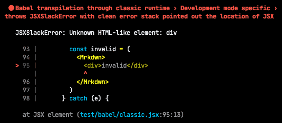
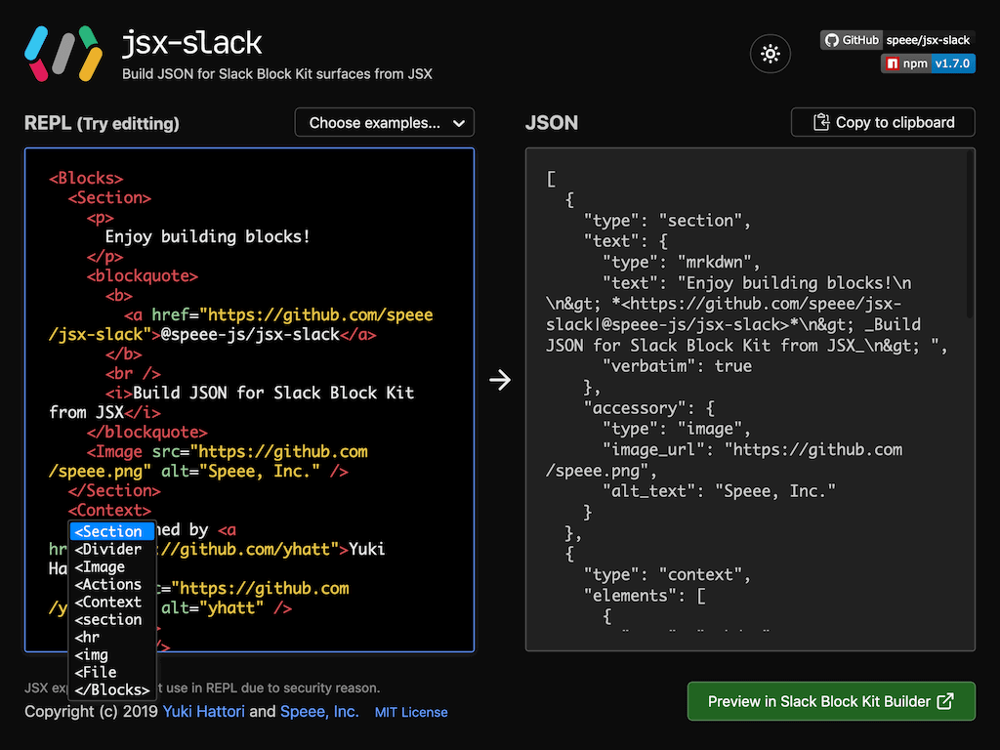

###### [Top](../../README.md) &raquo; jsx-slack v2

# jsx-slack v2

<p align="center">
  
</p>

Welcome to jsx-slack v2! Let me introduce shiny new features and check points for migration.

## Migration from v1

Don't be scared! **The basic usage of jsx-slack is exactly same as v1.** Almost user of jsx-slack don't need to change the code written in v1 and can bump jsx-slack to v2 straightly. :sunglasses:

`<CheckboxGroup>` and `<Checkbox>` have a breaking change may have the impact to initial options. If you are using TypeScript, you may see a new compile errors by more strict type chcecking.

See details in "**[Breaking change](#breaking-change)**" section if you have using them.

## Highlights

The traditional usage of jsx-slack was wrapping JSX in `JSXSlack()` function.

Since v1.5.0, some components have not been required to wrap by made serializable to JSON directly. And v2 will take this concept a step further!

### JSX returns the real JSON

The core API for JSX has updated, _to return the real JSON object for Slack API from all built-in components._

It means always no need to wrap JSX in `JSXSlack()`! Just writing JSX would work.

```jsx
console.log(
  <Blocks>
    <Section>
      Welcome to <b>jsx-slack v2</b>!
    </Section>
  </Blocks>
)
```

<!-- prettier-ignore -->
```javascript
[{
  type: 'section',
  text: {
    type: 'mrkdwn',
    text: 'Welcome to *jsx-slack v2*!',
    verbatim: true
  }
}]
```

<!-- prettier-ignore-end -->

`JSXSlack()` is still provided but there is no operataions. Just return the passed value.

#### Create partial JSON

Fully renewed built-in components will be useful to build a partial JSON too.

v1 components might return an invalid object with Slack API by including internal fields for jsx-slack, but v2 will always create the valid partial JSON.

```jsx
console.log(
  <Mrkdwn>
    Welcome to <b>jsx-slack v2</b>!
  </Mrkdwn>
)
```

```javascript
{ type: 'mrkdwn', text: 'Welcome to *jsx-slack v2*!' }
```

#### Tips for TypeScript

When you are using TypeScript, the returned type from JSX would not match to Slack Node SDK so **require to cast JSX into the suitable type**.

<!-- prettier-ignore -->
```typescript
(
  <Blocks>
    <Section>TypeScript needs to cast</Section>
  </Blocks>
) as any
```

<!-- prettier-ignore-end -->

`JSXSlack()` has become just a type helper to cast JSX into `any` type. _We recommend for TS developer to wrap JSX in `JSXSlack()` as same as jsx-slack v1._

```typescript
// TS user should use the compatible syntax with jsx-slack v1
JSXSlack(
  <Blocks>
    <Section>TypeScript needs to cast</Section>
  </Blocks>
)
```

### React-compatible API

We've organized JSX features and added some public API compatible with React.

- `JSXSlack.createElement()` (means as same as `JSXSlack.h()`)
- `JSXSlack.isValidElement()`
- `JSXSlack.Children`
  - `JSXSlack.Children.map()`
  - `JSXSlack.Children.forEach()`
  - `JSXSlack.Children.count()`
  - `JSXSlack.Children.only()`
  - `JSXSlack.Children.toArray()`

### Improved JSDoc

Slack Block Kit has continuously evolved. jsx-slack is working harder to catch up on the latest release of Slack API.

On the other hand, the documentation of jsx-slack has bloated compared to the first version. jsx-slack aims to the alternative interface for building Slack Block Kit easily, but developer would not want dizzy eyes by switching between the code and jsx-slack documentation.

jsx-slack v2 has included JSDoc to many public APIs. While using jsx-slack through JSX transpiler, developer can peek a useful instant help without leaving IDE.


### `<Option selected>` and `<RadioButton checked>`

jsx-slack makes a better experience for building Block Kit JSON, with the familiar HTML style. v2 added support for (HTML-compatible) `<Option selected>` and `<RadioButton checked>`.

```jsx
<Blocks>
  <section>
    <p>Select options:</p>
    <select multiple name="options">
      <option selected>Option A</option>
      <option selected>Option B</option>
      <option>Option C</option>
    </select>
  </section>
</Blocks>
```

Contents of `<Blocks>` will work both in HTML and jsx-slack. It makes a better developer experience in setting the initial state of the static select and the radio button group.

`<Select value="...">` and `<RadioButtonGroup value="...">`, the classic way to set initial selected / checked option(s), will still work. Please notice that _`selected` and `checked` will be ignored_ when setting `value` prop in the parent component.

```jsx
<Blocks>
  <section>
    <b>NOTE: Prefer the parent `value` prop to `selected` state.</b>
    <select multiple name="options" value="c">
      <option value="a" selected>
        Option A
      </option>
      <option value="b" selected>
        Option B
      </option>
      <option value="c">Option C (Actually selected)</option>
    </select>
  </section>
</Blocks>
```

> :warning: To make consistency in the whole of jsx-slack, v2 has a breaking change for the behavior of `<CheckboxGroup values={[...]}>` and `<Checkbox checked>` (They already have provided since v1). See details in "[Breaking change](#breaking-change)".

### More helpful error message

jsx-slack will throw an error when there is invalid JSX structure, but the error message in v1 is not so helpful to know where is the cause.

```jsx
// v1 throws "<Actions> block has an incompatible element as children.", but which element is?
<Blocks>
  <Actions>
    <ConversationsSelect name="conversations" multiple />
    <Button name="send" style="primary">
      Send
    </Button>
    <Button name="cancel" style="danger">
      Cancel
    </Button>
  </Actions>
</Blocks>
```

v2 has improved a lot of error messages, to display the specific reason of error and a name of built-in component which was triggered an error as possible.

In the above case, v2 throws the error with more useful message: `<Actions> cannot include the element for selection from multiple options: <ConversationsSelect multiple>`

**BONUS**: If you are using [`@babel/preset-react`](https://babeljs.io/docs/en/babel-preset-react) with `development` mode, the stack trace of the error will point out the exact JSX location instead of jsx-slack's internal. It becomes easy to move quickly into the errored JSX.



### [REPL demo in v2][repl]

[repl]: https://speee-jsx-slack.netlify.app/

[Our REPL][repl] is not just a demonstration of jsx-slack. REPL in v2 has more improvements for a practical use as yet another Block Kit builder.

Now REPL generates the permalink to specific JSX edited by user, as same as Slack's Block Kit Builder. You'll get easy to share the prototype of blocks written in JSX with your own team. [Let's see a permalink to the custom JSX from here.](https://speee-jsx-slack.netlify.app/#jsx:eJw9zjEKAjEUhOHeU0xnIy5YB4sFG7WQTWMbk6c-kk2WvKzgHQQv4EE8jxfwChIRq_m7b1QbkvWynABKky2cYm2gW-22uCxwokjZFBKUM2Gg3JvA0aMkyECWj2yx1nuQ40IOhytGoTyDEYjpqa4Oxvqp4EthwwXtyMFRnuP1uL2f94o3f101v08fzEQ1Iw==)

In addition, a bit outdated looking have made modernization to flat style, and we have supported dark mode! You can switch to your favorite brightness from the button at right-top.

[][repl]

### The other notable updates

- `<Home>` container now accepts `<Input type="hidden" />` and custom transformer to store private metadata.
- `value` prop for `<Option>` has made optional. jsx-slack will generate `value` text from the content for display if `value` was not defined.
- Some interactive components have added `value` prop, as work as an alias into existing `initialXXX` prop. No need to worry different interfaces for setting initial value by components.
- `confirm` prop for interactive block elements accepts the raw confirm composition object.
- `<a>` tag now renders short syntax for hyperlink if possible.

## Experimental features

### Support `automatic` runtime of [Babel JSX transpiler](https://babeljs.io/docs/en/babel-preset-react)

Babel has expected [many breaking changes for JSX transpiler](https://github.com/babel/babel/issues/10746) in next major version 8. Prior to them, [Babel 7.9.0 has shipped with a new JSX transformation](https://babeljs.io/blog/2020/03/16/7.9.0) that was based on [React RFC](https://github.com/reactjs/rfcs/blob/createlement-rfc/text/0000-create-element-changes.md), called as `automatic` runtime. It would be a default runtime of JSX in Babel 8.

jsx-slack v2 has an experimental implementation to support new JSX transformation `automatic` runtime.

```javascript
// babel.config.js
module.exports = (api) => ({
  presets: [
    [
      '@babel/preset-react',
      {
        runtime: 'automatic',
        importSource: '@speee-js/jsx-slack',
        development: api.env('development'),
      },
    ],
  ],
})
```

The advantage is no longer need to require importing implicitly used `JSXSlack` manually.

```jsx
const { Blocks, Section } = require('@speee-js/js-slack')

console.log(
  <Blocks>
    <Section>
      <p>Hello, world!</p>
    </Section>
  </Blocks>
)
```

Developers only have to import required built-in components so JSX code will look like more intuitive. See details in [#142](https://github.com/speee/jsx-slack/pull/142).

## Breaking change

### `<CheckboxGroup values={[...]}>` and `<Checkbox checked>`

v1 had merged initially checked options defined by _both of `<Checkbox checked>` and `<CheckboxGroup values>`_.

```jsx
// In jsx-slack v1, B and C will set as initial options.
<Home>
  <Actions>
    <CheckboxGroup values={['b']}>
      <Checkbox value="a">A</Checkbox>
      <Checkbox value="b">B</Checkbox>
      <Checkbox value="c" checked>
        C
      </Checkbox>
    </CheckboxGroup>
  </Actions>
</Home>
```

However, this behavior may not set correct initial states when setting initial values from Slack callback through `values` prop of `<CheckboxGroup>`.

jsx-slack v2 will **always adopt either of them, and prefer `<CheckboxGroup values>` to `<Checkbox checked>`**. The state defined in `checked` prop of `<Checkbox>` would be adopted only when not defined `values` prop in the parent `<CheckboxGroup>`.

In the above case, _will be ignored the `checked` state of C, and initially checked options become only B._

### Changes for TypeScript

- Now requires **TypeScript >= 3.7**, due to using [recursive type](https://www.typescriptlang.org/docs/handbook/release-notes/typescript-3-7.html#more-recursive-type-aliases) in JSX.

* All of container components and some interactive components have more strict children type checking. If you saw new compile errors, please ensure that children have only valid components.
  - Especially if you are using [React-like conditional rendering `{value && <Section>...</Section>}`](https://reactjs.org/docs/conditional-rendering.html#inline-if-with-logical--operator), the left side of `&&` operator must be boolean (e.g. `{!!value && <Section>...</Section>}`).

- Exported type `JSXSlack.Child` and `JSXSlack.Children` in v1 have been renamed into `JSXSlack.ChildElement` and `JSXSlack.ChildElements` to avoid conflict with added React-compatible API, and meaningless generics defined in them were removed.

## Deprecated

- `jsxslack.raw` has already deprecated because the new JSX structure let it become no need to use. Just rename `jsxslack.raw` into `jsxslack` to fix.

---

###### [Top](../../README.md) &raquo; jsx-slack v2
